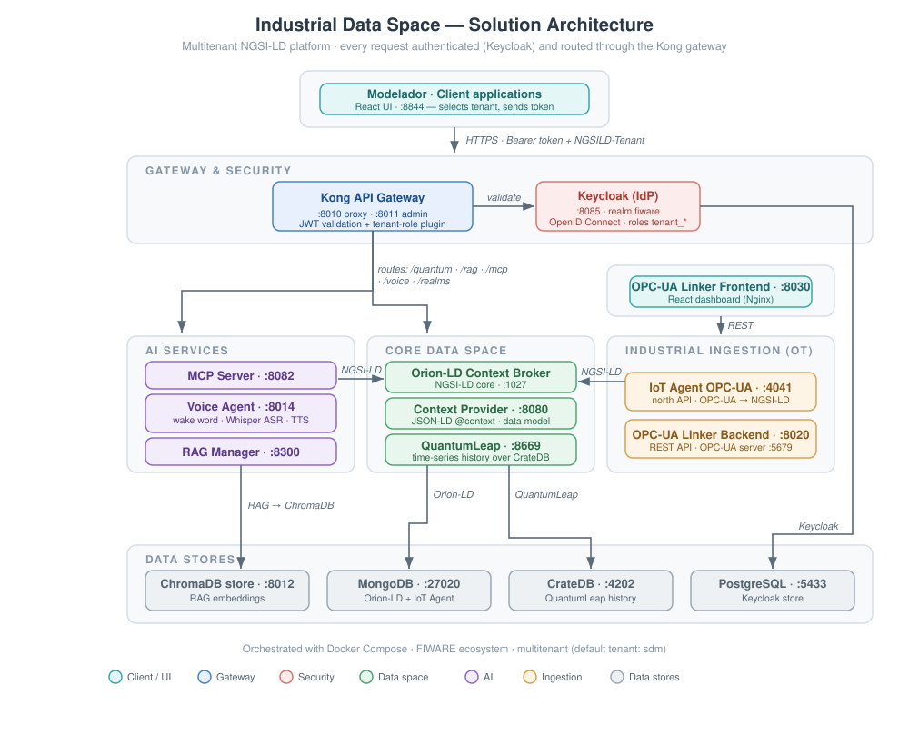

# Smart Data Models for Industry

A platform for the integration, modeling, and exploitation of industrial data, bridging the operational (OT) and information (IT) layers over an NGSI-LD data space. The system combines OPC-UA data acquisition, a shared data model, secured service orchestration, time-series history, and a set of AI agents for control and natural-language interaction.

> **Language:** English | [Español](README.es.md)

## Overview

The system takes data from industrial devices and systems (PLCs, SCADAs, sensors), normalizes it, and brings it into a data space where it can be modeled, queried, and consumed by analytics and AI services.

Industrial sources expose their data over OPC-UA. An IoT Agent translates that information into the NGSI-LD standard and integrates it into the data space, backed by the Orion-LD context broker. On top of this foundation sit a data modeler, time-series persistence, and several AI services that consume and act on the information.

The platform is **multitenant**: each factory data model lives in its own tenant. Every request is authenticated and authorized — all traffic goes through the Kong API gateway, which validates identity tokens issued by Keycloak and enforces tenant-level access control. The whole stack is containerized and orchestrated with Docker Compose.

## Architecture Diagram

## Deployment

Full step-by-step instructions for bringing up the stack on a clean machine — prerequisites, `.env` provisioning, build, Keycloak and Kong configuration, and troubleshooting — are in the **[Deployment Guide](DEPLOYMENT.md)**.

## Architecture

The system is organized into decoupled containers, orchestrated with Docker Compose and exposed through a common gateway. Client applications never talk to the internal services directly — all traffic is routed and secured through Kong.

### API Gateway & Security

- **Kong** — API gateway and single entry point for the whole system (`:8010` public proxy, `:8011` admin API). It routes requests to the internal services and enforces security in two layers: JWT validation (verifying tokens issued by Keycloak) and a custom **`tenant-role`** plugin that authorizes each request against the tenant declared in the `NGSILD-Tenant` header. Token requests are also proxied through Kong to Keycloak. From the user's perspective, everything points to Kong, never to the components or Keycloak directly.
- **Keycloak** — Identity Provider (IdP) for the platform (`:8085`), using the `fiware` realm. It manages users, clients, and roles, and issues OpenID Connect tokens (access + refresh JWTs), enabling SSO and centralized identity management. Authorization follows a multi-tenant model: each tenant maps to a realm role named `tenant_<tenant-name>` (the default tenant is `sdm`, with role `tenant_sdm`).

### Client

- **Modelador** — NGSI-LD entity modeling application and primary user-facing client (React UI, `:8844`). Users connect by selecting a tenant and authenticating against Keycloak; all subsequent requests carry that tenant scope through the gateway.

### Core Data Space

- **Orion-LD** — FIWARE NGSI-LD context broker at the core of the system (`:1027`); manages entities and their lifecycle, isolated per tenant.
- **Context Provider** — JSON-LD `@context` server (Nginx, `:8080`) that serves the shared data model. It defines the NGSI-LD terms and types used across the platform, so entities in Orion-LD and the applications that consume them share a common, resolvable vocabulary.
- **QuantumLeap** — Time-series persistence for NGSI-LD data (`:8669`), storing history over CrateDB.

### AI Services

- **MCP Server** — Model Context Protocol server (`:8082`); conversational industrial agent exposing system capabilities to AI tooling (chat / LLM API).
- **RAG Manager** — Retrieval-Augmented Generation manager (`:8300`) for natural-language queries over technical manuals and system information; backed by the ChromaDB vector store.
- **Voice Agent** — Voice interaction agent (`:8014`): wake word, ASR (Whisper), and TTS.

### Industrial Ingestion (OT)

- **IoT Agent OPC-UA** — Ingests industrial data over OPC-UA and translates device variables into NGSI-LD (`:4041` north API). The bridge between the operational and information layers.
- **OPC-UA Linker — Backend** — REST API (`:8020`) that drives the linker, plus a built-in simulated OPC-UA server (`:5679`) for development and testing without physical hardware.

The **OPC-UA Linker — Frontend** (React dashboard served by Nginx, `:8030`) is the operator-facing UI for this layer: it visually maps the industrial topology (the OPC-UA server's NodeIds) onto the semantic model in Orion-LD, provisioning devices declaratively and setting sampling/publish intervals. It talks to the Linker Backend over REST.

### Data Stores

- **ChromaDB** (`:8012`) — Vector store for RAG embeddings, consumed by the RAG Manager.
- **MongoDB** (`:27020`) — Backing store for Orion-LD and the IoT Agent (NGSI-LD entities, per tenant).
- **CrateDB** (`:4202`) — Backing store for QuantumLeap time-series history.
- **PostgreSQL** (`:5433`) — Backing store for Keycloak (users, roles, clients).

## Request Flow

1. A client (e.g. the Modelador application) authenticates against Keycloak — through Kong — and obtains an OpenID Connect access token.
2. Every subsequent request is sent to Kong, including the `Authorization: Bearer <token>` header and the `NGSILD-Tenant` header indicating the target tenant.
3. Kong validates the JWT against Keycloak and runs the `tenant-role` plugin, checking that the token carries the `tenant_<name>` role matching the requested tenant (e.g. `tenant_sdm` for tenant `sdm`).
4. If validation passes, Kong routes the request to the corresponding internal service (Orion-LD, QuantumLeap, RAG manager, MCP Server, or Voice Agent).

## Tech Stack

- **Industrial / data standards:** OPC-UA, NGSI-LD, FIWARE
- **Identity & security:** Keycloak (OpenID Connect), Kong API Gateway, JWT
- **Backend:** Python
- **Frontend:** React
- **AI:** RAG, ChromaDB (vector database), MCP, Whisper (ASR)
- **Data stores:** MongoDB, CrateDB, PostgreSQL, ChromaDB
- **Infrastructure:** Docker, Docker Compose, Nginx

## Documentation

- **[Deployment Guide](DEPLOYMENT.md)** — prerequisites, installation, build, and configuration on a clean machine.
- **[User Guide — Getting Started](USER_GUIDE.md)** — create a user, grant tenant access, and open the example data models.