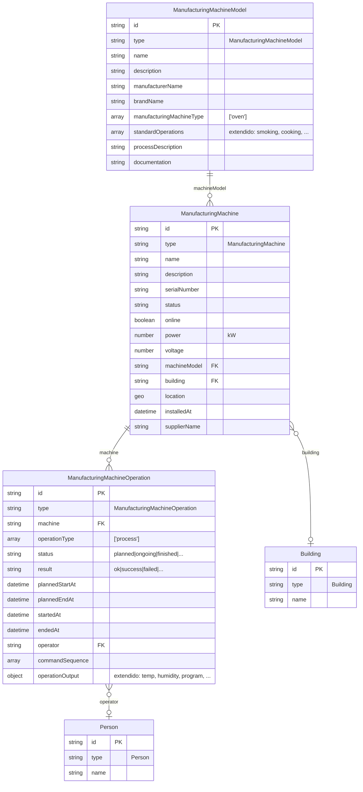
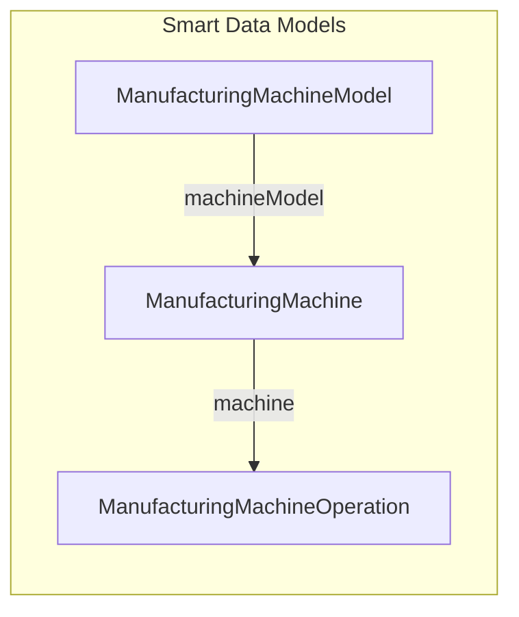

# Data Model – Horno industrial (cámara de ahumado y cocción)

Resumen de entidades para el espacio de datos de un horno industrial de cámara de ahumado y cocción, genérico respecto a fabricante y modelo. Basado en [Smart Data Models](https://github.com/smart-data-models) (reutilización prioritaria, extensión solo cuando aplique, creación solo si es estrictamente necesario).

**Documentos relacionados:** [mapa-decisiones-data-model-horno.md](./mapa-decisiones-data-model-horno.md) (especificación formal), [extensions.md](./extensions.md) (extensiones y enums Device). Schemas y validación: `schemas/README.md`, `python scripts/validate.py` (OK: `--- 24 ejemplos válidos, 0 errores ---`; errores: `[ERROR] archivo: mensaje` y exit 1).

---

## 1. Listado de entidades

| # | Entidad | Origen | Acción | Descripción |
|---|---------|--------|--------|-------------|
| 1 | **ManufacturingMachineModel** | [dataModel.ManufacturingMachine](https://github.com/smart-data-models/dataModel.ManufacturingMachine) | **Reutilizar** | Modelo/catálogo del horno. Tipo `oven` ya existe en el enum `manufacturingMachineType`. |
| 2 | **ManufacturingMachine** | dataModel.ManufacturingMachine | **Reutilizar** | Instancia física del horno (cada equipo instalado). Identificación, ubicación, potencia, estado, relación con edificio. |
| 3 | **ManufacturingMachineOperation** | dataModel.ManufacturingMachine | **Reutilizar** | Cada ciclo de trabajo (ahumado, cocción, secado, etc.). Relación a la máquina, fechas, resultado y datos de ciclo en `operationOutput`. |
| 4 | **Building** (opcional) | Smart Cities / Cross-sector | **Reutilizar** | Si el horno está en un edificio y quieres representarlo; `ManufacturingMachine.building` apunta aquí. |
| 5 | **Person** / **Organization** (opcional) | Schema.org / comunes | **Reutilizar** | Operador (`ManufacturingMachineOperation.operator`), propietario (`machineOwner`), proveedor. |
| 6 | **Device** + **DeviceMeasurement** (opcional) | [dataModel.Device](https://github.com/smart-data-models/dataModel.Device) | **Reutilizar** | Solo si necesitas series temporales de temperatura/humedad como entidades separadas (sensores). |
| 7 | Perfil de horno (atributos extendidos) | — | **Extender** | No es una entidad nueva: usar **ManufacturingMachineModel** con `manufacturingMachineType: ["oven"]` y `standardOperations` extendido con los procesos típicos (reddeningWarming, smoking, cooking, etc.). |
| 8 | Operación de horno (perfil de `operationOutput`) | — | **Extender** | No es una entidad nueva: **ManufacturingMachineOperation** con `operationOutput` definido (temperatura, humedad, programa, pasos, RH control, etc.). |
| 9 | **Ninguna entidad nueva** | — | **No crear** | No se requiere entidad específica “IndustrialOven” ni “SmokingChamber”; el horno es una `ManufacturingMachine` de tipo `oven`. |

---

## 2. Resumen por acción

### Reutilizar (sin cambios de esquema)

- **ManufacturingMachineModel** – Modelo del horno (tipo oven).
- **ManufacturingMachine** – Cada horno instalado.
- **ManufacturingMachineOperation** – Cada ciclo/operación (proceso, mantenimiento, etc.).
- **Building** – Opcional; ubicación del horno.
- **Person** / **Organization** – Operador, propietario, proveedor.
- **Device** + **DeviceMeasurement** – Opcional; sensores (temperatura/humedad) si se modelan como entidades propias.

### Extender (mismo tipo de entidad, atributos/valores específicos)

- **ManufacturingMachineModel**  
  - `standardOperations`: lista extendida con los procesos típicos (reddeningWarming, roastingBaking, drying, smoking, cooking, evacuation, airCirculation, dryingMaturing, maturing, cleaning0, cleaning1, cleaning2).
- **ManufacturingMachineOperation**  
  - `operationOutput`: esquema recomendado para el horno (ver sección 4).

### Crear

- **Ninguna.** No se define entidad nueva; se usan las anteriores con perfiles/extensiones indicados.

---

## 3. Diagrama del data model (entidades principales)

---

## 4. Perfil de extensión: `operationOutput` (ManufacturingMachineOperation)

Para cada ciclo del horno, se recomienda un **objeto** `operationOutput` con la siguiente estructura (extensión de uso, no nueva entidad):

| Campo | Tipo | Descripción |
|-------|------|-------------|
| `programName` / `programId` | string | Nombre o ID del programa ejecutado. |
| `temperatureSetPoint` | number | Temperatura objetivo del ciclo/paso (°C). |
| `temperatureMin` / `temperatureMax` | number | Mín/máx de temperatura registrados en el ciclo. |
| `humiditySetPoint` | number | Humedad objetivo (% RH) si aplica. |
| `humidityMin` / `humidityMax` | number | Mín/máx de humedad si aplica. |
| `controlMode` | string | `"Time"` \| `"RoomTemperature"` \| `"ProductTemperature"`. |
| `rhControl` | boolean | Si se usó control de humedad (RH). |
| `processSteps` | array of string | Lista de procesos por paso (e.g. smoking, cooking, drying). |
| `durationMinutes` | number | Duración total del ciclo en minutos. |
| `alarms` / `errors` | array | Códigos de alarma o error durante el ciclo (opcional). |

---

## 5. Diagrama simplificado (solo entidades reutilizadas)

---

## 6. Respuestas a decisiones de diseño

### 6.1 Sensores: según documentación del equipo y cómo modelarlos

La documentación de instrucciones de equipos de cámara de ahumado y cocción describe de forma explícita las **sondas y sensores** que suelen llevar. A continuación se extrae qué hay que modelar y cómo encajarlo en Smart Data Models (Device + OCF o DeviceMeasurement).

---

#### 6.1.1 Sensores y sondas típicos

| Sensor / sonda | Ubicación / función | Magnitud | Unidad / rango | Referencia en documentación |
|----------------|---------------------|----------|----------------|---------------------------|
| **Sonda de humedad (humidity probe)** | Medición psicométrica de humedad en cámara; control de humidificación (RH control) y “moistening probe”. Cuba con agua y paño de humedad. | Humedad relativa (RH) | % (implícito) | Checklist: “water tanks for the psychometric measurement of the moisture”, “moisture sensors are intact… moisture sensor is covered with its original moisture cloth”. Instalación de humidificación “controlled through the moistening probe”. Alarmas 26 (Lack of water in basin / Moist thermometer), 31 (Humidity thermometer: outside temperature signal or discontinuous wire). Probe Calibration: “humidity probes”. |
| **Sonda de temperatura de producto (product temperature probe)** | Temperatura en el interior del producto. Modo de control “Product Temperature”; pasteurización. | Temperatura | °C | Error tecnológico 8: “Check position of the product probe”, “Replace the product probe”, “Product probe calibration”. Alarma 32: “Product thermometer: outside temperature signal or discontinuous wire”. Probe Calibration: “product temperature”. Calibración: sonda y termómetro patrón en hielo/agua (0 °C). |
| **Sonda de temperatura de cámara 1, 2, 3, 4 (room temperature)** | Hasta 4 puntos de temperatura en el interior de la cámara (termómetros de ambiente). | Temperatura | °C (máx. programación 150 °C) | Alarmas 11 (Chamber thermostat error > 150 °C), 20/21 (Low-Temperature chamber 1/2), 22/23 (High-Temperature chamber 1/2), 33 (Thermometer 1 Chamber 1), 34 (Thermometer 2 Chamber 2). Probe Calibration: “room temperature 1, 2, 3 and room temperature 4”. Servicio: “Temp Hysteresis” (histéresis de temperatura). |
| **Termostato de seguridad cámara** | Sistema de regulación de temperatura máxima; instalado en caja en tapa de cámara. | Temperatura (límite) | 150 °C | Cap. “The installation of the temperature regulatory system”: “installed at the location at 150°C”. Alarma 11: “Chamber temperature > 150°C”. |
| **Sonda de temperatura del generador de humo** | Temperatura en el interior del generador de humo. Protección contra incendio. | Temperatura | °C (límite 180 °C) | Doc. típico: “fire protection thermostat which, at a temperature of 180°C, switches off the installation”. Alarma 16: “Smoke generator thermostat error”, “Temperature inside smoke generator >180°C”, “The temperature probe of the smoke generator is damaged”. |

Además, el TC muestra en **Probe Calibration** los “reading and display values” de: humidity probes, product temperature, room temperature 1, 2, 3 y room temperature 4. En **Quick Settings** aparecen **Temp Hysteresis** y **Humid Hysteresis** (bandas de tolerancia para control). El **módulo de entradas de temperatura** del sistema se cita en alarma 2: “Lack or default of temperature inputs module” (AT4222).

---

#### 6.1.2 Resumen: entidades de sensor a modelar por horno

| # | Identificador lógico | Tipo de magnitud | Entidad recomendada para el valor | Notas |
|---|----------------------|------------------|------------------------------------|--------|
| 1 | Humidity probe (psychometric / moistening) | Humedad relativa | **DeviceMeasurement** | Una o más sondas; calibración conjunta con “temperature monitor in the room”. |
| 2 | Product temperature probe | Temperatura | **DeviceMeasurement** | Device (sonda) en hasPart; cada lectura como DeviceMeasurement. |
| 3 | Room temperature 1 | Temperatura | **DeviceMeasurement** | Una entidad por punto (1–4 según configuración). |
| 4 | Room temperature 2 | Temperatura | **DeviceMeasurement** | |
| 5 | Room temperature 3 | Temperatura | **DeviceMeasurement** | |
| 6 | Room temperature 4 | Temperatura | **DeviceMeasurement** | |
| 7 | Smoke generator temperature probe | Temperatura | **DeviceMeasurement** | Límite seguridad 180 °C. |
| 8 | Chamber safety thermostat | Temperatura (límite) | Opcional: mismo que room o atributo en ManufacturingMachine | 150 °C; puede modelarse como configuración/límite, no obligatorio como entidad separada. |

Cada **sonda física** (el “aparato”) puede ser un **Device** que forma parte del horno: **ManufacturingMachine.hasPart** → [Device humidity probe, Device product temp, Device room temp 1, …]. Cada **medición** (temperatura o humedad) se modela como **DeviceMeasurement** (valor + unidad + timestamp + `refDevice`), de modo que se mantenga **histórico** de forma natural: una entidad por lectura.

---

#### 6.1.3 Recomendación de modelado: Device (sonda) + DeviceMeasurement (temperatura y humedad)

Para poder mantener **histórico** de todas las mediciones de forma uniforme, se utiliza **Device + DeviceMeasurement** tanto para **temperatura** como para **humedad** (no se usa OCF Temperature).

- **Temperatura y humedad**  
  - Cada sonda física (temperatura producto, room 1–4, generador de humo, humedad) es un **Device** incluido en **ManufacturingMachine.hasPart**.  
  - Cada lectura se modela como una entidad **DeviceMeasurement** con: valor, unidad (p. ej. °C para temperatura, % para humedad), timestamp y **`refDevice`** apuntando al Device (sonda) que generó la medición.  
  - Para distinguir temperatura de humedad en DeviceMeasurement se puede usar un atributo tipo **`measuredProperty`** (p. ej. `temperature`, `relativeHumidity`) o convención de categoría/unidad.  
  - Una entidad DeviceMeasurement por lectura permite construir series temporales e histórico sin necesidad de otro modelo.

- **Trazabilidad y jerarquía**  
  - **ManufacturingMachine** (horno) con **`hasPart`** (extensión) → lista de **Device** (sondas: product temp, room temp 1–4, smoke generator temp, humidity probe).  
  - Cada **DeviceMeasurement** con **`refDevice`** al Device (sonda) correspondiente.  
  - Temp Hysteresis / Humid Hysteresis pueden quedar como parámetros del TC o del programa (por ejemplo en **ManufacturingMachineOperation.operationOutput** o en configuración del Device), no necesitan entidades propias.

---

#### 6.1.4 Decisión adoptada: Device + DeviceMeasurement para todo (histórico)

Se ha adoptado **Device + DeviceMeasurement** para **todas** las mediciones (temperatura y humedad) con el fin de:

- Mantener **histórico** de forma natural: cada lectura es una entidad con valor y timestamp.
- Usar un **único patrón** para todos los sensores (temperatura y humedad).
- Evitar mezclar OCF Temperature (una entidad por sonda, valor actual) con DeviceMeasurement (humedad); así toda la serie temporal es homogénea.

Cada sonda es un **Device** en `hasPart` del horno; cada medición es un **DeviceMeasurement** con `refDevice` a esa sonda y un atributo (p. ej. `measuredProperty` o unidad) que indica si es temperatura o humedad.

### 6.2 Dispositivos dentro del horno (PLC, Burner, Fans, etc.) y ManufacturingMachine

En la documentación de este tipo de equipo, el horno se describe como compuesto por:

- **Cámara de proceso** (processing chamber).  
- **Generador de humo** (smoke generator): depósito de serrín, motor, placas, placa de combustión, filtro de ceniza, bandeja de ceniza, **resistencia de encendido (1 kW)**, **motor de extracción (0,2 kW)**.  
- **Instalación de limpieza automática** (bombas, válvulas, boquillas).  
- **Instalación de cocción y humidificación** (boquillas, cuba con resistencias en variante eléctrica, sonda de humedad).  
- **Sistema de circulación y extracción de aire**: **motor, ventilador, cámara de circulación**; **ventilador de extracción** (potencias según configuración).  
- **Cuadro eléctrico** (switchboard).  
- **Touch-Control (TC)** (panel de control / “PLC” que ejecuta programas, ciclos y comandos).  
- **Quemador(es)** en variante gas (referencia a “burner/burners manufacturer”).  
- **Carros/racks** (trolleys): no hay cinta transportadora; la carga va en carros que se introducen en la cámara.

La entidad **ManufacturingMachine** del [dataModel.ManufacturingMachine](https://github.com/smart-data-models/dataModel.ManufacturingMachine) **no** define atributos para “contiene” o “hasPart” (submáquinas o dispositivos internos). Solo tiene, entre otros, `building`, `machineModel`, `location`, `power`, `voltage`, `status`, `supportedProtocol`.

**Opciones para modelar los dispositivos internos:**

1. **Reutilizar Device (dataModel.Device)**  
   - Una entidad **Device** por cada componente que quieras representar (TC, quemador, ventiladores, generador de humo, etc.).  
   - **Extender** el modelo Device (o usar atributo existente si lo hay) con una relación **“installedIn”** o **“controlledBy”** apuntando al `id` de la **ManufacturingMachine** (el horno).  
   - Si Device no define esa relación en el estándar, se puede añadir como **atributo de extensión** (ej. `refMachine` o `installedIn`) tipo Relationship hacia la ManufacturingMachine.

2. **Extender ManufacturingMachine con un nuevo atributo**  
   - Añadir p. ej. **`hasPart`** o **`contains`** como array de identificadores (URIs) de entidades (Device u otras) que representen los componentes.  
   - Así el horno “contiene” explícitamente Panel TC, Burner, Fans, Smoke generator (como Device), etc., sin cambiar el esquema de Device.

3. **No crear entidad nueva**  
   - Los componentes se documentan en **ManufacturingMachine.description** o en un documento enlazado por **seeAlso**, y solo se modelan como entidades (Device) aquellos que necesites consultar o medir por separado (ej. sensores OCF, TC si se integra como dispositivo).

**Resumen:**  
- **ManufacturingMachine no contempla** por defecto dispositivos internos.  
- **Recomendación:** usar **Device** para cada componente relevante (Touch-Control, burner, ventiladores, generador de humo, etc.) y **extender** bien **Device** con una relación al horno (ej. `refMachine` / `installedIn` → ManufacturingMachine) o bien **ManufacturingMachine** con `hasPart` → [Device, ...]. Así se mantiene interoperabilidad y se evita crear una entidad nueva “IndustrialOvenComponent”.

---

### 6.3 Ubicación: Building vs planta / zona (Place, Location, ManufacturingMachineLocation)

- **ManufacturingMachine** en el estándar tiene:  
  - **`building`**: relación a una entidad (típicamente [Building](https://github.com/smart-data-models/dataModel.Building)) que representa el edificio.  
  - **`location`**: GeoJSON (Point, Polygon, etc.) para coordenadas.  
  - **`address`**: dirección postal (schema.org).  
  No define “planta”, “zona” ni “planta industrial” como entidad estándar.

- En **Smart Data Models** no hay una entidad estándar llamada “ManufacturingMachineLocation” ni “Plant”. Sí existen:  
  - **Building** (Smart Cities / dataModel.Building): edificio.  
  - **Place** (u otras en dominios como turismo): lugar genérico.  
  - Modelos **SAREF/S4BLDG** (p. ej. [dataModel.S4BLDG](https://github.com/smart-data-models/dataModel.S4BLDG)): espacios dentro de edificios (Building, BuildingSpace, etc.), que pueden usarse para “zona” o “sala” si se mapean así.

En industria es habitual usar **planta (site/factory) y zona (area/cell)**. Opciones sin inventar entidades nuevas:

1. **Seguir con Building + address + location**  
   - **Building** = edificio de la fábrica (o la nave).  
   - **address** (en ManufacturingMachine o en Building): incluir en `addressLocality` o en un campo de texto libre el nombre de planta/zona (ej. “Planta 1 – Zona Ahumado”).  
   - **location**: GeoJSON para posición del horno.

2. **Jerarquía Building → espacios (BuildingSpace / Room)**  
   - Si usas [dataModel.Building](https://github.com/smart-data-models/dataModel.Building) o S4BLDG con **Building** y espacios (ej. sala, celda), puedes tener Building = “Planta X” y un espacio hijo = “Zona Ahumado”; luego **ManufacturingMachine.building** apunta al **espacio** (zona) en lugar de al edificio completo, si el esquema lo permite (relación a entidad tipo Building/Place).

3. **Extensión mínima**  
   - Añadir a **ManufacturingMachine** dos atributos opcionales de **extensión**: p. ej. **`plant`** (string) y **`zone`** (string), o un único **`areaServed`** (ya existe en el modelo) con valor “Planta 1 – Zona Ahumado”. Así no creas entidad “ManufacturingMachineLocation” ni “Plant”; solo enriqueces la máquina con contexto de ubicación lógica.

**Recomendación:**  
- **Building** para el edificio/nave es estándar y suficiente para muchos casos.  
- Para **planta y zona** sin nueva entidad: usar **Building** (o un Place/BuildingSpace si se quiere jerarquía) + **extensión** en ManufacturingMachine con **`plant`** y **`zone`** (o **`areaServed`**) según necesidad. Si más adelante Smart Data Models o tu dominio definen una entidad “Plant” o “Facility”, se puede sustituir la extensión por una relación a esa entidad.

---

### 6.4 Proceso: ManufacturingMachineOperation vs IndustrialProcess

- **[ManufacturingMachineOperation](https://github.com/smart-data-models/dataModel.ManufacturingMachine)** (dataModel.ManufacturingMachine):  
  - Representa **una ejecución concreta** de una operación en **una máquina concreta**: tiene `machine` (relación a ManufacturingMachine), `startedAt`, `endedAt`, `status`, `result`, `operationType` (process, maintenance, repair, etc.), `operationOutput`.  
  - Encaja con: “el horno X ejecutó el ciclo de ahumado Y entre las 10:00 y las 18:00 con este resultado y estos parámetros”.

- **[dataModel.IndustrialProcess](https://github.com/smart-data-models/dataModel.IndustrialProcess)** (Smart Manufacturing):  
  - Contiene entidades orientadas a **proceso industrial genérico** (origen: siderurgia, proyecto ALCHIMIA): **MaterialAddition**, **ProcessChemicalAnalysis**, **ProcessEvent**, y un esquema común con propiedades como `processName`, `heatNumber`.  
  - **No** define una entidad “IndustrialProcess” como tal que sea un análogo directo de “una ejecución de ciclo en una máquina”; está más orientado a eventos, adiciones de material y análisis químicos dentro de un proceso.

**Conclusión:**  
- Para **“un proceso/ciclo ejecutado en el horno”** (con máquina, fechas, resultado, operationOutput), **ManufacturingMachineOperation** es la opción correcta y estándar.  
- **IndustrialProcess** sirve para **eventos, adiciones de material o análisis** dentro de un proceso; si en el futuro quieres registrar, por ejemplo, “evento de cambio de paso” o “análisis de humedad en un instante”, podrías usar **ProcessEvent** (o similares) y relacionarlos con la **ManufacturingMachineOperation** (ej. por `operationId` o `refOperation`).  
- **Recomendación:** **mantener ManufacturingMachineOperation** como entidad principal para cada ciclo/operación del horno; usar **IndustrialProcess** (ProcessEvent, etc.) solo si necesitas modelar eventos o análisis concretos dentro del proceso y quieres alinearte con ese modelo.

---

## 7. Resumen de decisiones (preguntas 1–4)

| Pregunta | Decisión |
|----------|----------|
| **1. Sensores** | **Device + DeviceMeasurement** para todas las mediciones (temperatura y humedad). Cada sonda física como **Device** en **ManufacturingMachine.hasPart**; cada lectura como **DeviceMeasurement** con `refDevice` y timestamp, para mantener **histórico**. |
| **2. Dispositivos dentro del horno** | TC, quemador, ventiladores, generador de humo, cuadro eléctrico, etc. **ManufacturingMachine** no define en el estándar “hasPart”. Usar **Device** por componente + **extender** con `refMachine`/`installedIn` hacia el horno, o **extender** ManufacturingMachine con **`hasPart`**. |
| **3. Ubicación: Building vs planta/zona** | **Building** es estándar para edificio. No hay “Plant”/“ManufacturingMachineLocation” estándar. Opción: Building + **extensión** en ManufacturingMachine (**`plant`**, **`zone`** o **`areaServed`**) para planta/zona. |
| **4. ManufacturingMachineOperation vs IndustrialProcess** | **Mantener ManufacturingMachineOperation** para cada ciclo/operación del horno. IndustrialProcess (ProcessEvent, MaterialAddition, etc.) sirve para eventos/análisis dentro del proceso, no para sustituir la operación. |

---

## 9. Otros aspectos modelables (opcionales)

Aspectos que la documentación del equipo o un espacio de datos industrial suelen contemplar y que se pueden añadir sin crear entidades nuevas, o reutilizando modelos existentes.

| Aspecto | Descripción | Cómo modelarlo | Prioridad |
|---------|------------------------------|----------------|-----------|
| **Programas / recetas** | El TC tiene hasta 100 programas de 98 pasos; cada paso: proceso, modo de control (Time / Room temp / Product temp), RH, nivel calefacción, circulación, extracción, temperatura, duración. | No hay entidad “Recipe” estándar en Manufacturing. Opciones: (1) **operationOutput** ya guarda `programName`/`programId` y `processSteps` cuando se ejecuta; (2) si necesitas la receta como entidad reutilizable, documentarla en **ManufacturingMachineModel.standardOperations** o en un recurso externo enlazado por **seeAlso** / **documentation**; (3) entidad ligera “Program” con pasos como JSON (extensión mínima) solo si es imprescindible. | Baja si solo registras la ejecución; media si expones catálogo de programas. |
| **Alarmas / eventos** | Lista de alarmas (códigos 0–46, 99, 100): fallos de módulos, termostatos, sondas, quemador, etc. | **OCF Alarm** ([dataModel.OCF](https://github.com/smart-data-models/dataModel.OCF)) para estado de alarma; o **ProcessEvent** ([dataModel.IndustrialProcess](https://github.com/smart-data-models/dataModel.IndustrialProcess)) por cada ocurrencia (timestamp, código, máquina). Alternativa: **ManufacturingMachine.status** con código de alarma actual y/o **operationOutput.alarms** en la operación en curso. | Media si quieres historial de alarmas o integración con mantenimiento. |
| **Mantenimiento e inspección** | Revisión recurrente (semestral recomendada), mantenimiento diario/quincenal/anual, limpieza del generador de humo. | **ManufacturingMachineOperation** con **operationType** `["maintenance"]` o `["repair"]`: cada intervención es una operación (fechas, resultado, descripción). Opcional: [dataModel.PredictiveMaintenance](https://github.com/smart-data-models/dataModel.PredictiveMaintenance) si se hace mantenimiento predictivo. **subscriptionService** en ManufacturingMachine para contrato de servicio. | Alta si se registran intervenciones. |
| **Registro de lavados (Washing Log)** | El TC guarda fecha/hora de cada lavado (programa de limpieza). | **ManufacturingMachineOperation** con **operationType** `["process"]` y **operationOutput** con `processSteps` / `programName` indicando limpieza (ej. programa 100), o tipo “maintenance” si se considera mantenimiento. Una operación por lavado. | Media para trazabilidad higiénica. |
| **Contadores (Counters)** | Tiempo en cada proceso: semana actual, mes actual, desde último servicio, total desde instalación. | Atributos de **extensión** en **ManufacturingMachine** (ej. `countersHoursByProcess`, `lastServiceAt`) o entidades **DeviceMeasurement** / observaciones agregadas por proceso y período. Alternativa: derivar de historial de **ManufacturingMachineOperation** (suma de duraciones por `operationOutput.processSteps`). | Baja si se calcula desde operaciones; media si el TC expone contadores en tiempo real. |
| **Consumo energético** | Tablas de potencia por configuración; “Energy” en Quick Settings del TC. | [Smart Energy](https://github.com/smart-data-models/SmartEnergy) tiene modelos de medición de energía. Opción sencilla: **DeviceMeasurement** con magnitud consumo (kWh) por máquina o por operación; o **operationOutput.energyConsumedKWh** en cada **ManufacturingMachineOperation**. | Media si se requiere eficiencia o facturación. |
| **Consumibles / materiales** | Serrín (0–3 mm, madera dura), agua (humectación, limpieza), detergente (programa 100). | [dataModel.IndustrialProcess](https://github.com/smart-data-models/dataModel.IndustrialProcess) **MaterialAddition**: adición de material a un proceso. Opcional: referencia en **operationOutput** (ej. `materialUsed` o `batchId`) por ciclo. Útil para trazabilidad en industria alimentaria. | Baja a media según trazabilidad. |
| **Lote / producto procesado** | Qué producto o lote se procesa en cada ciclo (trazabilidad alimentaria). | No hay entidad “Batch” estándar en Manufacturing. **operationOutput** puede incluir **`batchId`**, **`productType`** o **`refProduct`** (URI a entidad de lote/producto si existe en tu ecosistema). Si usas GS1 o estándares de trazabilidad, enlazar por identificador. | Alta si hay requisitos de trazabilidad. |
| **Conformidad / certificación** | Directivas y normas (seguridad, higiene, ruido). | **ManufacturingMachineModel** o **ManufacturingMachine**: atributo de **extensión** (ej. `conformity` o `certification`) con lista de directivas/normas, o **seeAlso** a documento de conformidad. | Baja salvo requisito contractual. |
| **Números de serie de componentes** | Número de serie de cámara, generador de humo, panel de control. | Cada **Device** (TC, generador de humo, etc.) en **hasPart** puede tener **serialNumber** si el modelo Device lo incluye; si no, en **description** o atributo extendido. | Baja; ya cubierto si modelas Device por componente. |

**Resumen:** Lo ya definido (máquina, operaciones, sensores, componentes, ubicación) cubre el núcleo. Los puntos de esta sección son **opcionales** y se pueden incorporar cuando haya necesidad: mantenimiento y lavados como **ManufacturingMachineOperation**; alarmas como **OCF Alarm** o **ProcessEvent**; lote/producto y consumibles en **operationOutput** o **MaterialAddition**; energía y contadores por extensión o DeviceMeasurement.

---

## 10. Referencias

- [mapa-decisiones-data-model-horno.md](./mapa-decisiones-data-model-horno.md) — Especificación formal del modelo.
- [extensions.md](./extensions.md) — Extensiones y enums Device.
- [smart-data-models](https://github.com/smart-data-models) – Smart Manufacturing
- [dataModel.ManufacturingMachine](https://github.com/smart-data-models/dataModel.ManufacturingMachine) (ManufacturingMachine, ManufacturingMachineModel, ManufacturingMachineOperation)
- [dataModel.Device](https://github.com/smart-data-models/dataModel.Device) (Device, DeviceMeasurement – opcional)
- [Smart-Sensoring](https://github.com/smart-data-models/Smart-Sensoring) (Device + OCF)
- [dataModel.OCF](https://github.com/smart-data-models/dataModel.OCF) (Temperature, Humidity, AirFlow, etc.)
- [dataModel.IndustrialProcess](https://github.com/smart-data-models/dataModel.IndustrialProcess) (ProcessEvent, MaterialAddition, ProcessChemicalAnalysis)
- [dataModel.PredictiveMaintenance](https://github.com/smart-data-models/dataModel.PredictiveMaintenance) (mantenimiento predictivo – opcional)
- [dataModel.OCF Alarm](https://github.com/smart-data-models/dataModel.OCF/tree/master/Alarm) (estado de alarma – opcional)
- [Smart Energy](https://github.com/smart-data-models/SmartEnergy) (consumo energético – opcional)
- [dataModel.Building](https://github.com/smart-data-models/dataModel.Building), [dataModel.S4BLDG](https://github.com/smart-data-models/dataModel.S4BLDG) (Building, BuildingSpace)
