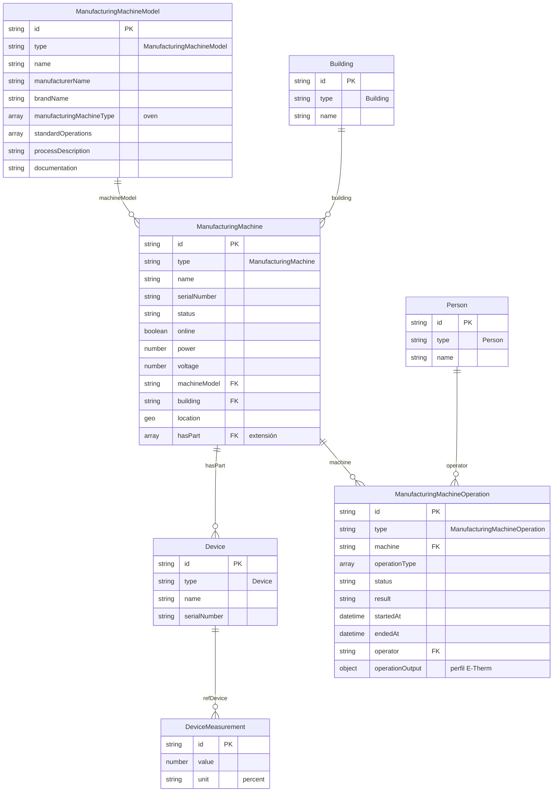

# Especificación del modelo de datos – Horno industrial E-Therm

**Versión:** 1.0  
**Alcance:** Espacio de datos industrial para cámara de ahumado y cocción E-Therm (Emerson Technik).  
**Basado en:** Smart Data Models; manual *Operation instructions Smoking & cooking chamber E-Therm*.  
**Documento de referencia:** [data-model-horno-industrial.md](./data-model-horno-industrial.md).

---

## 1. Objetivo y alcance

| Elemento | Descripción |
|----------|-------------|
| **Objetivo** | Definir el modelo de datos (entidades, tipos, atributos y relaciones) para la representación del horno industrial E-Therm en un espacio de datos interoperable. |
| **Criterios** | Reutilización de modelos existentes (Smart Data Models); extensión únicamente donde el estándar lo permita; no creación de entidades nuevas salvo necesidad estricta. |
| **Formato** | Entidades compatibles con NGSI-LD (contexto JSON-LD, identificadores URI, relaciones explícitas). |

---

## 2. Principios de modelado

- **Reutilizar:** Emplear entidades y atributos estándar de Smart Data Models sin modificar esquemas publicados.
- **Extender:** Introducir únicamente atributos de extensión acordados (`hasPart` en ManufacturingMachine; perfil de `operationOutput` en ManufacturingMachineOperation; valores extendidos en `standardOperations`).
- **No crear:** No se definen tipos de entidad propios (p. ej. IndustrialOven, SmokingChamber); el horno se representa como **ManufacturingMachine** con `manufacturingMachineType` = `"oven"`.

---

## 3. Listado de entidades

### 3.1 Inventario

| # | Entidad | Tipo NGSI (`type`) | Origen | Descripción |
|---|---------|---------------------|--------|-------------|
| 1 | ManufacturingMachineModel | `ManufacturingMachineModel` | dataModel.ManufacturingMachine | Modelo o catálogo del equipo (E-Therm). |
| 2 | ManufacturingMachine | `ManufacturingMachine` | dataModel.ManufacturingMachine | Instancia física del horno instalado. |
| 3 | ManufacturingMachineOperation | `ManufacturingMachineOperation` | dataModel.ManufacturingMachine | Ejecución de un ciclo u operación (proceso, mantenimiento, limpieza). |
| 4 | Building | `Building` | dataModel.Building / Smart Cities | Edificio o nave donde se ubica el horno. |
| 5 | Person | `Person` | Schema.org / común | Operador u otra persona relacionada. |
| 6 | Organization | `Organization` | Schema.org / común | Propietario, proveedor u organización relacionada. |
| 7 | Device | `Device` | dataModel.Device | Componente o sonda física del horno (TC, quemador, ventiladores, generador de humo, sondas). |
| 8 | DeviceMeasurement | (según dataModel.Device) | dataModel.Device | Medición (temperatura o humedad) producida por un Device (sonda). Una entidad por lectura; permite histórico. |

### 3.2 Clasificación por rol

| Rol | Tipos de entidad |
|-----|-------------------|
| **Catálogo / modelo** | ManufacturingMachineModel |
| **Activo físico** | ManufacturingMachine, Building, Device |
| **Evento / ejecución** | ManufacturingMachineOperation |
| **Observación / medición** | DeviceMeasurement |
| **Actor** | Person, Organization |

---

## 4. Esquemas por entidad

A continuación se indican, para cada tipo, los atributos relevantes y su tipo de dato. `(E)` = extensión acordada; el resto son estándar del modelo indicado.

### 4.1 ManufacturingMachineModel

| Atributo | Tipo | Obligatorio | Descripción |
|----------|------|-------------|-------------|
| `id` | URI | Sí | Identificador único de la entidad. |
| `type` | string | Sí | Valor fijo: `"ManufacturingMachineModel"`. |
| `name` | string | No | Nombre del modelo. |
| `description` | string | No | Descripción del modelo. |
| `manufacturerName` | string | No | Fabricante (ej. Emerson Technik). |
| `brandName` | string | No | Marca (ej. E-Therm). |
| `manufacturingMachineType` | array[string] | No | Valores del enum; en este modelo: `["oven"]`. |
| `standardOperations` | array[string] | No | **(E)** Lista extendida de procesos: `reddeningWarming`, `roastingBaking`, `drying`, `smoking`, `cooking`, `evacuation`, `airCirculation`, `dryingMaturing`, `maturing`, `cleaning0`, `cleaning1`, `cleaning2`. |
| `processDescription` | string | No | Descripción del proceso industrial. |
| `documentation` | string (URI) | No | Enlace a documentación o manual. |

### 4.2 ManufacturingMachine

| Atributo | Tipo | Obligatorio | Descripción |
|----------|------|-------------|-------------|
| `id` | URI | Sí | Identificador único de la entidad. |
| `type` | string | Sí | Valor fijo: `"ManufacturingMachine"`. |
| `name` | string | No | Nombre o identificador del equipo. |
| `description` | string | No | Descripción del horno. |
| `serialNumber` | string | No | Número de serie de la cámara. |
| `status` | string | No | Estado actual (código o texto). |
| `online` | boolean | No | Conectividad (true/false). |
| `power` | number | No | Potencia nominal (kW). |
| `voltage` | number | No | Tensión nominal (V). |
| `machineModel` | Relationship (URI) | No | Referencia al ManufacturingMachineModel. |
| `building` | Relationship (URI) | No | Referencia al Building. |
| `location` | GeoProperty (GeoJSON) | No | Coordenadas o geometría. |
| `address` | object | No | Dirección postal (schema.org). |
| `installedAt` | date-time | No | Fecha de instalación. |
| `supplierName` | string | No | Proveedor del equipo. |
| `hasPart` | array[URI] | No | **(E)** Lista de URIs de entidades Device (componentes y sondas). |

### 4.3 ManufacturingMachineOperation

| Atributo | Tipo | Obligatorio | Descripción |
|----------|------|-------------|-------------|
| `id` | URI | Sí | Identificador único de la entidad. |
| `type` | string | Sí | Valor fijo: `"ManufacturingMachineOperation"`. |
| `machine` | Relationship (URI) | No | Referencia a la ManufacturingMachine. |
| `operationType` | array[string] | No | Valores: `process`, `maintenance`, `repair`, etc. |
| `status` | string | No | Enum: `planned`, `ongoing`, `finished`, `scheduled`, `cancelled`. |
| `result` | string | No | Enum: `ok`, `success`, `suspended`, `aborted`, `failed`. |
| `plannedStartAt` | date-time | No | Inicio previsto. |
| `plannedEndAt` | date-time | No | Fin previsto. |
| `startedAt` | date-time | No | Inicio real. |
| `endedAt` | date-time | No | Fin real. |
| `operator` | Relationship (URI) | No | Referencia a Person (operador). |
| `commandSequence` | array[string] | No | Secuencia de comandos o pasos. |
| `operationOutput` | object | No | **(E)** Objeto con perfil E-Therm: ver tabla 4.4. |

### 4.4 Perfil de operationOutput (extensión)

| Campo | Tipo | Descripción |
|-------|------|-------------|
| `programName` / `programId` | string | Identificador o nombre del programa ejecutado. |
| `temperatureSetPoint` | number | Temperatura objetivo (°C). |
| `temperatureMin` / `temperatureMax` | number | Temperatura mín./máx. registrada en el ciclo. |
| `humiditySetPoint` | number | Humedad objetivo (% RH). |
| `humidityMin` / `humidityMax` | number | Humedad mín./máx. registrada. |
| `controlMode` | string | `Time` \| `RoomTemperature` \| `ProductTemperature`. |
| `rhControl` | boolean | Uso de control de humedad (RH). |
| `processSteps` | array[string] | Lista de procesos por paso. |
| `durationMinutes` | number | Duración total del ciclo (minutos). |
| `alarms` / `errors` | array | Códigos de alarma o error durante el ciclo. |
| `batchId` / `productType` | string | (Opcional) Trazabilidad de lote o producto. |

**Uso para comandos y setpoints:** Los parámetros seteados del ciclo (temperatura, humedad, modo de control, etc.) se escriben en **operationOutput** de la `ManufacturingMachineOperation` en curso. El encendido/apagado del horno se expresa en `ManufacturingMachine.status`. Detalle en [extensions.md](./extensions.md#4-uso-para-comandos-y-setpoints-integración-agente--middleware).

### 4.5 Building

| Atributo | Tipo | Obligatorio | Descripción |
|----------|------|-------------|-------------|
| `id` | URI | Sí | Identificador único. |
| `type` | string | Sí | Valor fijo: `"Building"`. |
| `name` | string | No | Nombre del edificio o nave. |
| `address` | object | No | Dirección. |
| `location` | GeoProperty | No | Geometría. |

### 4.6 Device

| Atributo | Tipo | Obligatorio | Descripción |
|----------|------|-------------|-------------|
| `id` | URI | Sí | Identificador único del dispositivo (componente o sonda). |
| `type` | string | Sí | Valor fijo: `"Device"`. |
| `name` | string | No | Nombre (ej. «Touch-Control», «Sonda temperatura producto»). |
| `description` | string | No | Descripción del componente. |
| `serialNumber` | string | No | Número de serie, si aplica. |
| `category` | array[string] | No | Enum oficial: `sensor`, `actuator`, `HVAC`, `meter`, `network`, etc. Ver [extensions.md](./extensions.md). |
| `controlledProperty` | array[string] | Sí | Enum oficial: `temperature`, `humidity`, `speed`, `smoke`, `power`, etc. Obligatorio según schema. |

#### Device – valores permitidos (modelo oficial)

Los ejemplos deben usar valores del enum oficial. No se extiende Device; se documentan aquí para referencia.

##### category (opcional)

`actuator`, `beacon`, `endgun`, `HVAC`, `implement`, `irrSection`, `irrSystem`, `meter`, `multimedia`, `network`, `sensor`

##### controlledProperty (obligatorio)

`airPollution`, `atmosphericPressure`, `averageVelocity`, `batteryLife`, `batterySupply`, `cdom`, `conductance`, `conductivity`, `depth`, `eatingActivity`, `electricityConsumption`, `energy`, `fillingLevel`, `freeChlorine`, `gasConsumption`, `gateOpening`, `heading`, `humidity`, `light`, `location`, `milking`, `motion`, `movementActivity`, `noiseLevel`, `occupancy`, `orp`, `pH`, `power`, `precipitation`, `pressure`, `refractiveIndex`, `salinity`, `smoke`, `soilMoisture`, `solarRadiation`, `speed`, `tds`, `temperature`, `trafficFlow`, `tss`, `turbidity`, `uvLampIntensity`, `uvOrganicLoad`, `waterConsumption`, `waterFlow`, `waterLevel`, `waterPollution`, `weatherConditions`, `weight`, `windDirection`, `windSpeed`

##### Mapeo usado en este proyecto

| Dispositivo | category | controlledProperty |
|-------------|----------|-------------------|
| Sondas temperatura | sensor | temperature |
| Sonda humedad | sensor | humidity |
| Quemador | actuator | temperature |
| Ventiladores | actuator | speed |
| Generador humo | actuator | smoke |
| Touch-Control (TC) | actuator | power |


*Nota:* La relación con el horno se expresa desde ManufacturingMachine mediante `hasPart` (no se exige atributo inverso en Device).

### 4.7 DeviceMeasurement (temperatura y humedad)

Todas las mediciones de sensores (temperatura y humedad) se modelan como **DeviceMeasurement**. Cada lectura es una entidad con valor y timestamp, lo que permite mantener **histórico** de forma natural.

| Atributo | Tipo | Obligatorio | Descripción |
|----------|------|-------------|-------------|
| `id` | URI | Sí | Identificador único de la medición (cada lectura puede ser una entidad distinta para histórico). |
| `type` | string | Sí | Según dataModel.Device (DeviceMeasurement). |
| `refDevice` | Relationship (URI) | No | Referencia al Device (sonda) que generó la medición. |
| `value` (o equivalente) | number | No | Valor numérico de la medición. |
| `unit` / `unitCode` | string | No | Unidad: para temperatura `CEL` (°C); para humedad `P1` (%). |
| `measuredProperty` (o análogo) | string | No | Tipo de magnitud: p. ej. `temperature`, `relativeHumidity`, para distinguir temperatura de humedad. |
| `timestamp` / `dateObserved` | date-time | No | Instante de la medición. |
| (resto según dataModel.Device) | — | — | Ver [dataModel.Device](https://github.com/smart-data-models/dataModel.Device). |

*Nota:* Un mismo Device (sonda de temperatura o de humedad) generará muchas entidades DeviceMeasurement a lo largo del tiempo, una por cada lectura registrada.

---

## 5. Relaciones entre entidades

### 5.1 Matriz de relaciones

| Entidad origen | Atributo de relación | Entidad destino | Cardinalidad |
|----------------|----------------------|-----------------|---------------|
| ManufacturingMachine | `machineModel` | ManufacturingMachineModel | N:1 |
| ManufacturingMachine | `building` | Building | N:1 |
| ManufacturingMachine | `hasPart` **(E)** | Device | 1:N |
| ManufacturingMachineOperation | `machine` | ManufacturingMachine | N:1 |
| ManufacturingMachineOperation | `operator` | Person | N:1 |
| Device | (referencia desde `hasPart`) | ManufacturingMachine | N:1 (implícita) |
| DeviceMeasurement | `refDevice` (o equivalente) | Device | N:1 |

### 5.2 Descripción de relaciones

| Relación | Descripción |
|----------|-------------|
| **ManufacturingMachineModel → ManufacturingMachine** | Un modelo de máquina puede tener múltiples instancias instaladas. Cada horno referencia un único modelo mediante `machineModel`. |
| **ManufacturingMachine → Building** | Cada horno puede estar ubicado en un único edificio. Opcional. |
| **ManufacturingMachine → Device (hasPart)** | Un horno se compone de uno o más dispositivos (TC, quemador, ventiladores, generador de humo, sondas). Extensión; cardinalidad 1:N. |
| **ManufacturingMachine → ManufacturingMachineOperation** | Una máquina ejecuta múltiples operaciones. Cada operación referencia una única máquina mediante `machine`. |
| **ManufacturingMachineOperation → Person** | Una operación puede tener un operador asignado. Opcional. |
| **DeviceMeasurement → Device** | Cada medición (temperatura o humedad) se asocia al Device (sonda) que la genera mediante `refDevice`. Una entidad DeviceMeasurement por lectura, lo que permite mantener histórico. |

---

## 6. Diagrama entidad-relación



---

## 7. Esquema de identificación (URIs)

Se recomienda un esquema de identificación coherente para todas las entidades, por ejemplo:

| Tipo de entidad | Formato de id (ejemplo) |
|-----------------|--------------------------|
| ManufacturingMachineModel | `urn:ngsi-ld:ManufacturingMachineModel:{uuid}` o URI del espacio de datos |
| ManufacturingMachine | `urn:ngsi-ld:ManufacturingMachine:{uuid}` |
| ManufacturingMachineOperation | `urn:ngsi-ld:ManufacturingMachineOperation:{uuid}` |
| Building | `urn:ngsi-ld:Building:{uuid}` |
| Person | `urn:ngsi-ld:Person:{uuid}` |
| Device | `urn:ngsi-ld:Device:{uuid}` (p. ej. uno por componente/sonda) |
| DeviceMeasurement | `urn:ngsi-ld:DeviceMeasurement:{uuid}` (una entidad por lectura si se desea histórico; o identificador que incluya timestamp) |

---

## 8. Resumen de extensiones

| Entidad | Atributo extendido | Tipo | Descripción |
|---------|--------------------|------|-------------|
| ManufacturingMachine | `hasPart` | array[URI] | Referencias a entidades Device que son parte del horno. |
| ManufacturingMachineModel | `standardOperations` (valores) | array[string] | Lista extendida de procesos del manual E-Therm. |
| ManufacturingMachineOperation | `operationOutput` (perfil) | object | Estructura acordada para programa, temperatura, humedad, pasos, duración, alarmas, etc. |

---

## 9. Schemas y validación

Los schemas locales (`schemas/`) extienden los modelos oficiales con `$ref` y `allOf` sin modificar atributos existentes. Para validar los ejemplos:

```bash
pip install -r requirements.txt
python scripts/validate.py
```

- **Todo OK:** lista de `[OK]` por archivo y `--- 24 ejemplos válidos, 0 errores ---` (exit code 0).
- **Con errores:** líneas `[ERROR] Carpeta/archivo.json: mensaje del error` y resumen `--- N ejemplos válidos, M errores ---` (exit code 1).

Ver [schemas/README.md](../schemas/README.md) y [docs/extensions.md](./extensions.md).

---

## 10. Referencias

- [data-model-horno-industrial.md](./data-model-horno-industrial.md) — Documento detallado con sensores, preguntas de diseño y aspectos opcionales.
- [extensions.md](./extensions.md) — Extensiones y enums Device (category, controlledProperty).
- [REFERENCES.md](../REFERENCES.md) — Enlaces a modelos oficiales.
- [Smart Data Models – Smart Manufacturing](https://github.com/smart-data-models/SmartManufacturing)
- [dataModel.ManufacturingMachine](https://github.com/smart-data-models/dataModel.ManufacturingMachine)
- [dataModel.Device](https://github.com/smart-data-models/dataModel.Device) (Device, DeviceMeasurement)
- Manual: *Operation instructions Smoking & cooking chamber E-Therm* (Emerson Technik)
