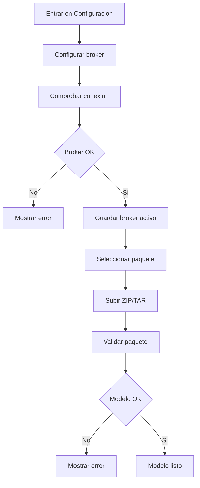
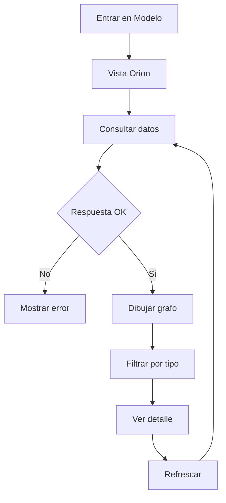
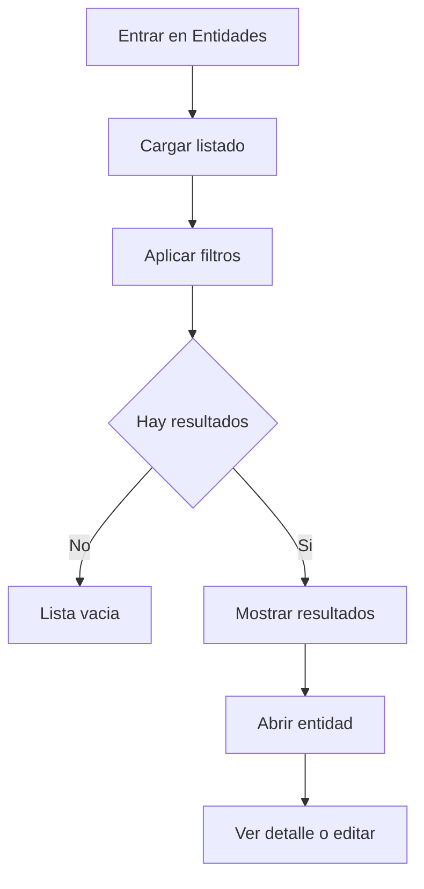
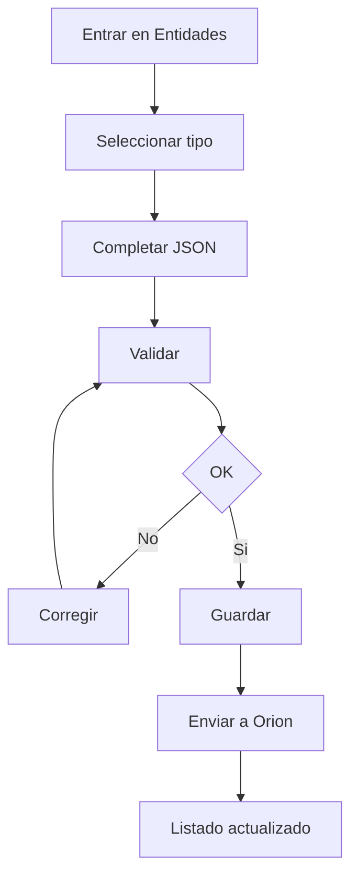
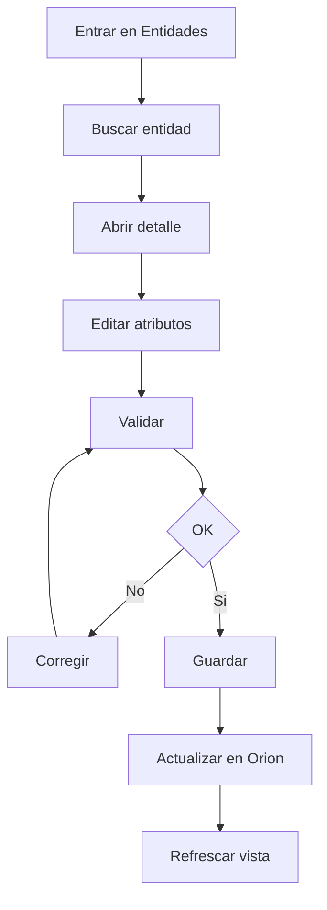

# Documentación funcional AS-IS

> **Documento histórico.** Fotografía del modelador con UI estática HTML/JS (sin auth integrada). Producto actual: React + sesión Orion/Keycloak. Ver [README.md](README.md) y [documentación vigente](../README.md).

## 1) Objetivo de la aplicación

Esta aplicación es un **modelador de espacios de datos NGSI-LD**: permite conectar a brokers **Orion-LD**, cargar la definición del modelo (schemas, contexto JSON-LD y recursos asociados), visualizar tipos y relaciones, y **dar de alta o modificar entidades** sin tener que construir a mano las peticiones HTTP al broker.

### Qué problema resuelve

El propósito del proyecto es **guiar** el modelado y la operación cotidiana sobre un espacio de datos NGSI-LD. El repositorio incluye ejemplos y escenarios de dominio industrial (p. ej. hornos, sensores), pero la herramienta aplica a **cualquier dominio** mientras el modelo y el contexto sean coherentes con NGSI-LD.

Evita que los equipos operen Orion-LD solo con herramientas de línea de comandos o clientes genéricos, reduciendo errores y tiempo.
Centraliza en una única interfaz la configuración del broker, la carga del modelo y la gestión de entidades.

Los esquemas pueden venir de distintas fuentes, incluyendo repositorios propios o catálogos como **Smart Data Models**.

El usuario puede:

- Configurar uno o varios brokers Orion-LD (nombre y URL) y comprobar conectividad.
- Cargar un modelo desde URLs o desde paquete comprimido (schemas, contexto JSON-LD, descriptor opcional y ejemplos).
- Visualizar el esquema y los datos ya persistidos en Orion (grafos, filtros, detalle).
- Crear, validar, editar, duplicar y eliminar entidades NGSI-LD a través del backend que hace de proxy hacia Orion.

## 2) Perfiles de uso

- Persona de negocio o funcional con conocimiento del dominio del espacio de datos.
- Persona técnica que integra o valida información en Orion-LD.

En el estado actual, no hay autenticación ni roles dentro de la herramienta.

## 3) Flujo funcional principal

1. Configuración
  - Introducir URL del broker.
  - Comprobar conectividad.
  - Guardar broker y seleccionarlo como actual.

Vista de Configuración

*Figura 1. Vista configuración del broker Orion-LD.*

1. Carga de modelo
  - Opción A: cargar desde URLs (schemas/context/descriptor/examples).
  - Opción B: cargar paquete comprimido (`.zip`, `.tar`, `.tar.gz`).
  - Persistencia local del modelo en el navegador.

Vista de Carga de modelo

*Figura 2. Vista configuración y carga de modelo a través de url o archivo comprimido.*

1. Visualización
  - Vista de esquemas (grafo).
  - Vista de datos en Orion (grafo).
  - Filtros por tipo y paneles de detalle.

Vista de Modelo y visualización

*Figura 3. Vista de Modelo con grafo de esquema/datos y filtros.*

1. Gestión de entidades
  - Crear una entidad nueva (JSON).
  - Validar que los datos cumplen el modelo.
  - Consultar el listado de entidades.
  - Buscar entidades por tipo o identificador.
  - Modificar atributos de una entidad existente.
  - Duplicar entidades.
  - Eliminar entidades.

Vista de Entidades

*Figura 4. Vista de Entidades para crear, listar, filtrar y editar.*

## 4) Pantallas y que puede hacer el usuario

| Pantalla                    | Para que sirve              | Acciones clave del usuario                                                  |
| --------------------------- | --------------------------- | --------------------------------------------------------------------------- |
| `Configuración` (`/`)       | Preparar entorno de trabajo | Guardar/seleccionar broker, comprobar conectividad, cargar o limpiar modelo |
| `Modelo` (`/visualizacion`) | Entender estructura y datos | Ver grafo de esquema, ver grafo Orion, filtrar por tipo, consultar detalles |
| `Entidades` (`/entidades`)  | Operar sobre entidades      | Crear, editar, duplicar, eliminar, buscar por tipo o ID                     |

- `Configuracion` (`/`)
  - Guardar y seleccionar brokers Orion-LD
  - Comprobar conectividad del broker
  - Cargar modelo desde URLs o paquete comprimido
  - Limpiar/reemplazar el modelo cargado
- `Modelo` (`/visualizacion`)
  - Ver el grafo del esquema (tipos y relaciones)
  - Ver el grafo de datos existentes en Orion
  - Filtrar por tipo de entidad
  - Consultar detalle de nodos y relaciones
- `Entidades` (`/entidades`)
  - Crear nuevas entidades
  - Editar atributos existentes
  - Eliminar entidades
  - Duplicar entidades
  - Buscar y filtrar por tipo o ID

La ruta `/modelo` sirve `modelo.html`, que en el estado actual **redirige al inicio** (`/`); la carga por URLs y por ZIP se realiza desde la pantalla principal de configuración.

## 5) Ejemplos de flujo detallado de uso

### Caso: Vincular broker activo y cargar modelo por ZIP

**Actor:** Usuario en la pantalla de `Configuración` (`/`).

**Precondiciones:**

- El usuario conoce la URL del broker Orion-LD.
- Dispone de un paquete de modelo en `zip`/`tar`/`tar.gz`.

**Flujo principal:**

1. El usuario accede a `Configuración`.
2. Introduce URL y nombre del broker y comprueba conectividad.
3. Guarda el broker y lo selecciona como activo.

Broker activo y conectado

*Figura 8. Broker validado y marcado como activo.*

1. Selecciona el archivo de paquete (`zip`/`tar`/`tar.gz`).
2. Inicia la carga.
3. La aplicación valida estructura y recursos del paquete.

Carga de modelo por ZIP

*Figura 9. Carga del paquete completada sin errores.*

1. Si la carga es correcta, el modelo queda activo para `Modelo` y `Entidades`.

Modelo cargado

*Figura 10. Confirmación de modelo disponible para operar.*

**Diagrama de flujo (resumen):**

**Errores frecuentes / rutas alternativas:**

- Si la URL del broker no es válida o no responde, no se activa el broker y se informa del fallo.
- Si el paquete no contiene estructura válida, la aplicación muestra error y no activa el modelo.

**Resultado esperado:**

- Broker activo guardado y modelo disponible para operar.

### Caso: Visualizar grafo de Orion en tiempo real

**Actor:** Usuario de la pantalla `Modelo` (`/visualizacion`).

**Precondiciones:**

- Hay broker activo y accesible.
- Existen entidades en Orion-LD.

**Flujo principal:**

1. El usuario entra en `Modelo`.
2. Selecciona vista de datos en Orion.
3. La aplicación consulta entidades y relaciones vigentes.
4. Se dibuja el grafo con nodos y enlaces.

Grafo Orion completo

*Figura 11. Ejemplo de grafo de Orion (caso de horno industrial): entidades y relaciones. Los nodos suelen poder arrastrarse; a la derecha, controles para acercar, alejar y centrar.*

1. El usuario filtra por tipo o selecciona nodos para inspeccionar detalle.

Grafo Orion con filtro

*Figura 12. Tras filtrar por tipo, solo permanecen en el grafo los tipos seleccionados; el conjunto de nodos visible se reduce respecto a la vista completa.*

1. Al refrescar o relanzar la consulta, el grafo refleja el estado actual del broker.

Detalle de nodo o relacion

*Figura 13. Panel de detalle del nodo seleccionado (en el ejemplo, tipo ManufacturingMachine / horno industrial).*

**Diagrama de flujo (resumen):**

**Errores frecuentes / rutas alternativas:**

- Si Orion no responde, no se dibuja el grafo y se informa del error.
- Si no hay datos, se muestra estado vacío sin nodos.

**Resultado esperado:**

- El usuario visualiza la topología vigente en Orion (entidades y relaciones consultadas en ese momento).

### Caso: Listar y filtrar entidades

**Actor:** Usuario de la sección `Entidades`.

**Precondiciones:**

- Hay broker activo y accesible.
- Existe al menos un conjunto de entidades cargadas en Orion-LD.

**Flujo principal:**

1. El usuario entra en `Entidades`.
2. Solicita listado general de entidades.

Listado sin filtros

*Figura 16. Listado completo sin filtros aplicados.*

1. Aplica filtros por tipo y/o texto (ID o contenido visible).
2. Revisa el subconjunto resultante.

Listado con filtro

*Figura 17. Resultados filtrados según el criterio introducido. En este caso el usuario busca entidades cuyo identificador contenga "001". Abajo, lista filtrada y conteo de coincidencias.*

1. Abre una entidad concreta para ver detalle o continuar con edición.

Listado vacio o error controlado

*Figura 18. Estado sin resultados o mensaje de error controlado cuando no coincide ningún resultado con los criterios de búsqueda.*

**Diagrama de flujo (resumen):**

**Errores frecuentes / rutas alternativas:**

- Si no hay coincidencias con el filtro, la lista queda vacía y se mantiene el contexto de búsqueda.
- Si hay error de red u origen, se informa al usuario y no se actualiza el listado.

**Resultado esperado:**

- El usuario localiza con rapidez entidades concretas y reduce ruido en operaciones de gestión.

### Caso: Crear una entidad

**Actor:** Usuario de la sección `Entidades`.

**Precondiciones:**

- Hay un broker Orion-LD seleccionado y accesible.
- Hay un modelo cargado (schemas/contexto) que define cómo debe ser la entidad.

**Flujo principal:**

1. El usuario entra en `Entidades`.
2. Selecciona el tipo de entidad que quiere crear.

Crear entidad - formulario

*Figura 5. Tipo seleccionado y formulario/JSON listo para editar.*

1. Completa el JSON de la entidad (manual o desde una plantilla).
2. El sistema valida automáticamente los datos.

Crear entidad - validacion

*Figura 6. Validación correcta o detalle de errores a corregir.*

1. Si la validación es correcta, el usuario guarda.
2. La aplicación envía la entidad al broker Orion-LD.
3. La entidad aparece en el listado.

Crear entidad - listado actualizado

*Figura 7. La nueva entidad en el listado de `Entidades`.*

**Diagrama de flujo (resumen):**

**Errores frecuentes / rutas alternativas:**

- Si el JSON no cumple el modelo, el sistema informa de qué campos o formatos fallan y no permite guardar hasta corregirlos.
- Si Orion-LD no responde, la operación no se completa y se muestra el error en la interfaz.

**Resultado esperado:**

- La entidad queda creada en Orion-LD y se refleja en la lista de `Entidades`.

### Caso: Editar atributos de una entidad

**Actor:** Usuario de la sección `Entidades`.

**Precondiciones:**

- Hay un broker Orion-LD seleccionado y accesible.
- El usuario tiene al menos una entidad existente (del tipo que quiere editar) en Orion-LD.

**Flujo principal:**

1. El usuario busca una entidad por tipo, por ID o por texto.

Búsqueda de entidad

*Figura 14. Resultados de búsqueda por tipo o identificador. En el ejemplo, búsqueda de entidades que contengan "burn" para editarlas.*

1. Abre la entidad en el panel de detalle.
2. Modifica los valores de los atributos que quiere cambiar.
3. El sistema valida los cambios.
4. El usuario guarda.
5. La aplicación actualiza la entidad en Orion-LD y refresca la vista.

Edición de entidad

*Figura 15. Una sola captura ilustra el flujo: detalle con atributos modificados (p. ej. descripción del quemador), guardado y vista coherente con Orion-LD.*

**Diagrama de flujo (resumen):**

**Errores frecuentes / rutas alternativas:**

- Si algún cambio no cumple el modelo (por ejemplo, tipos incorrectos o formato incorrecto), se muestran los errores y no se envía la actualización hasta corregir.

**Resultado esperado:**

- Los atributos modificados quedan actualizados en Orion-LD.

## 6) Reglas funcionales observadas

- El broker activo y el modelo se guardan en el navegador.
- La validación admite distintos formatos de entrada y adapta automáticamente ciertos campos para cumplir el modelo.
- Las llamadas a Orion-LD y a URLs remotas de schemas/contexto pasan por el backend (proxy), de modo que el navegador no las hace directamente al broker; en el modo habitual (misma origen que el API en `127.0.0.1:8000`) la interfaz usa ese backend.
- No hay persistencia propia de negocio en base de datos del sistema.

## 7) Persistencia en navegador

La aplicación utiliza `localStorage` para almacenar información relevante:

- `ngsi_brokers`
- `ngsi_current_broker_url`
- `ngsi_current_broker_name`
- `ngsi_model`
- `ngsi_orion_type_filter_keys`
- `ngsi_onboarding_hidden`
- `ngsi_onboarding_step3_done`
- `ngsi_entities_list_panel_width`

## 8) Fuera de alcance actual

- La herramienta no gestiona usuarios ni permisos.
- No existe historial de cambios propio dentro de la aplicación.
- El estado se guarda por navegador, no en una base de datos central.
- Las aprobaciones de cambios se hacen fuera de la herramienta.
- El trabajo colaborativo simultáneo no está cubierto de forma nativa.