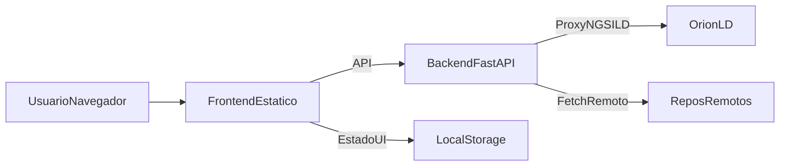

# AS-IS para reunion de arquitectura

> **Documento histórico.** Resumen de la reunión sobre la UI estática; varias limitaciones listadas ya están resueltas (React, auth). Ver [README.md](README.md).

## 1) Resumen ejecutivo

El sistema actual cumple el objetivo funcional principal: configurar brokers Orion-LD, cargar modelo, visualizar estructura y operar entidades NGSI-LD (alta/edicion/eliminacion) con validacion.

Fortalezas actuales:

- Backend FastAPI estable como proxy y capa de seguridad basica.
- Front funcional con buena cobertura operativa del caso de uso.
- Tests backend amplios para proxy, upload y validacion.

Limites actuales:

- Frontend en HTML/JS con logica distribuida (escala limitada).
- Sin persistencia propia de negocio (sin DB interna).
- Sin autenticacion/autorizacion.

## 2) Alcance funcional AS-IS (alto nivel)

- Configuracion de brokers Orion-LD.
- Carga de modelo por URLs o paquete comprimido.
- Visualizacion de esquema y datos en Orion (D3).
- CRUD operativo de entidades NGSI-LD.
- Validacion de entidad y de atributos contra reglas/schemas.

## 3) Arquitectura AS-IS

## 4) Componentes y responsabilidades

- `static/index.html`: configuracion de broker y carga de modelo.
- `static/visualizacion.html`: grafo de esquema y grafo Orion.
- `static/entidades.html`: alta/edicion/listado de entidades.
- `static/js/app.js`: utilidades comunes (API, estado local, alertas/toasts).
- `static/js/model-parser.js`: parseo de modelo/schemas.
- `backend/main.py`: endpoints API, proxy Orion, upload y validacion.

## 5) Inventario API (resumen)

- Salud/proxy Orion:
  - `GET /api/health`
  - `POST /api/proxy/entities`
  - `PATCH /api/proxy/entities/{entity_id}/attrs`
  - `DELETE /api/proxy/entities/{entity_id}`
  - `GET /api/proxy/entities/{entity_id}`
  - `GET /api/proxy/entities`
  - `POST /api/proxy/fetch`
- Modelo y validacion:
  - `GET /api/context`
  - `POST /api/upload/model-package`
  - `POST /api/validate/entity`
  - `POST /api/validate/attrs`

## 6) Estado de datos y persistencia

- Sin base de datos propia en el sistema AS-IS.
- Persistencia de estado cliente en `localStorage`.
- Cache en memoria backend para esquemas remotos.

## 7) Riesgos y deuda tecnica priorizada

1. Mantenibilidad front (logica y eventos en paginas grandes).
2. Acoplamiento a DOM/IDs y listeners (riesgo de regresiones UI).
3. Ausencia de capa de estado tipada centralizada.
4. Ausencia de autenticacion y trazabilidad de operaciones.

## 8) Decisiones para la reunion (propuesta de agenda)

1. Estrategia de refactor frontend:
   - migracion incremental vs big-bang.
   - React + TypeScript (propuesto) y criterios de done.

2. Modelo de despliegue front/back:
   - front separado + backend API (propuesto).
   - politica CORS por entornos (dev/test/prod).

3. Persistencia y trazabilidad:
   - necesidad de BD para versionado de entidades.
   - alcance minimo del registro (quien, cuando, que cambio).

4. Calidad y pruebas:
   - nivel minimo de e2e en front.
   - gates de PR (tests/lint/build).

5. Seguridad:
   - autenticacion de usuarios.
   - gestion de credenciales/secretos por entorno.

## 9) Propuesta de siguiente paso tras reunion

- Cerrar ADRs (Architecture Decision Records) de:
  - framework frontend,
  - estrategia de despliegue,
  - capa de persistencia/versionado.
- Convertir esas decisiones en roadmap de sprints.

