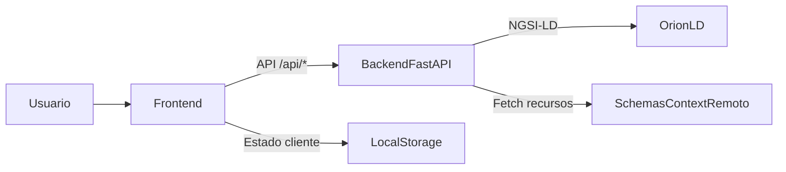
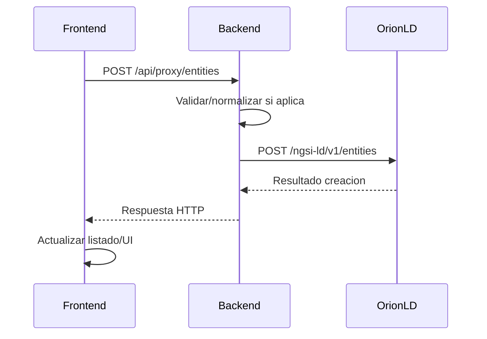
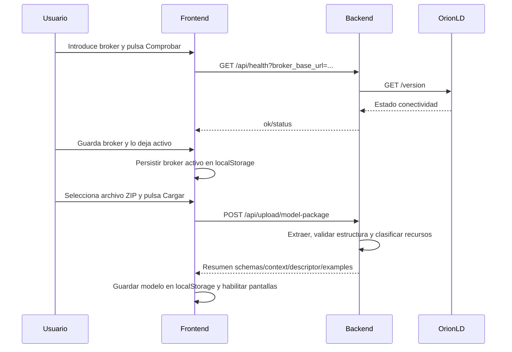
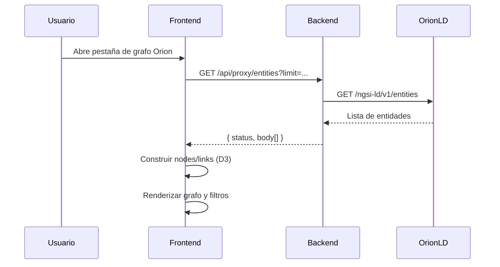
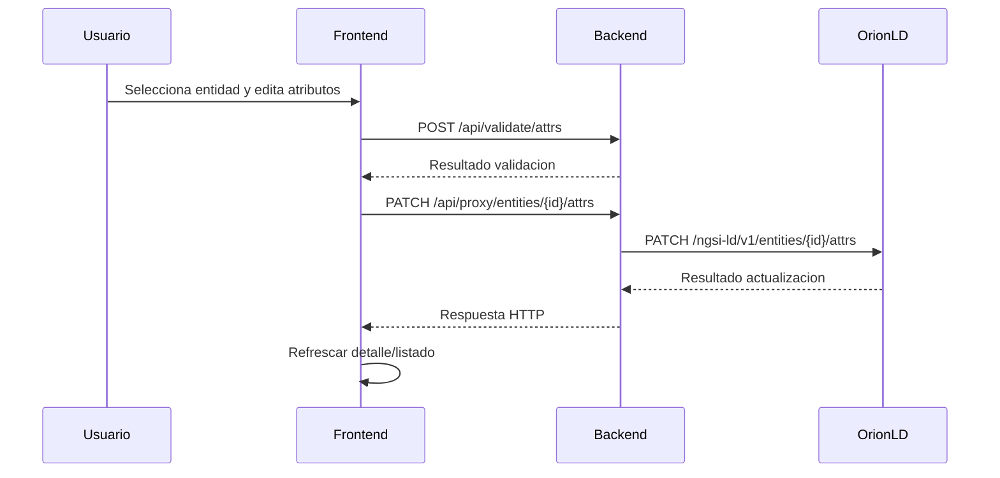
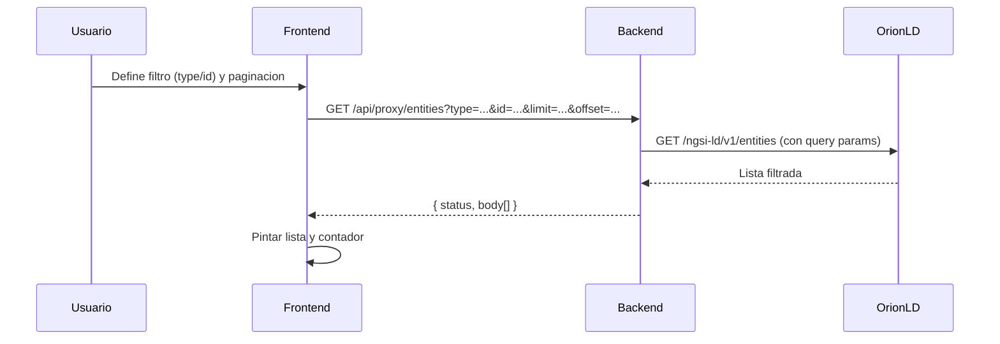

# Documentacion tecnica AS-IS

> **Documento histórico.** Describe la arquitectura con carpeta `static/` y sin las capacidades actuales (React, Marvin, RAG, AEA). Ver [README.md](README.md) y [documentación vigente](../README.md).

## 1) Arquitectura actual

Arquitectura de 3 capas logicas:

- Frontend estatico (HTML/CSS/JS) en `static/`.
- Backend FastAPI en `backend/main.py` (API, proxy, validacion y servidor de estaticos).
- Orion-LD como sistema externo de persistencia de entidades.




## 2) Estructura del proyecto

```text
07_INN_DATA_SPACE_MODELADOR/
├─ backend/                                # Capa servidor y API
│  ├─ main.py                              # Endpoints, proxy Orion, validacion, upload y rutas estaticas
│  ├─ requirements.txt                     # Dependencias Python del backend
│  └─ tests/                               # Tests backend
│     ├─ __init__.py                       # Marca del paquete de tests
│     ├─ conftest.py                       # Fixtures y configuracion de pytest
│     ├─ test_helpers.py                   # Tests de funciones auxiliares
│     ├─ test_proxy.py                     # Tests de endpoints proxy Orion
│     ├─ test_upload.py                    # Tests de carga y analisis de paquetes
│     └─ test_validate.py                  # Tests de validacion de entidad/atributos
├─ static/                                 # Frontend actual
│  ├─ css/
│  │  └─ app.css                           # Estilos globales y componentes visuales
│  ├─ js/
│  │  ├─ app.js                            # Utilidades de UI, brokers y llamadas a API
│  │  ├─ model-parser.js                   # Parseo de schemas, contexto y relaciones
│  │  ├─ test-model-parser.js              # Tests unitarios JS (Node) del parser
│  │  └─ d3.min.js                         # Libreria D3 embebida para grafos
│  ├─ index.html                           # Pantalla de configuracion (broker/modelo)
│  ├─ visualizacion.html                   # Visualizacion de esquema y datos Orion
│  ├─ entidades.html                       # Gestion de entidades
│  └─ modelo.html                          # Redireccion a configuracion
├─ docs/                                   # Documentacion de proyecto
│  ├─ README.md                            # Indice (vigente)
│  ├─ archive/                             # AS-IS historico (este documento)
│  │  ├─ AS_IS_FUNCIONAL.md
│  │  ├─ AS_IS_TECNICO.md
│  │  └─ AS_IS_REUNION.md
│  └─ casos-uso/                           # Guias IBERMOT / METAPAN (en preparacion)
├─ package.json                            # Scripts npm de arranque
└─ README.md                               # Guia general de ejecucion y uso
```

## 3) Funcionalidades por capa

### Frontend

- Gestion de formularios, listados, filtros y paneles.
- Construccion de payloads JSON para alta/edicion.
- Persistencia de estado de sesion en `localStorage`.
- Consumo de endpoints del backend y refresco de UI.

### Backend

- Exponer APIs para front.
- Proxy seguro hacia Orion-LD.
- Validar entidad y atributos contra schema.
- Analizar paquetes de modelo (zip/tar/tar.gz).
- Servir frontend estatico.

### Orion-LD

- Persistir entidades NGSI-LD.
- Responder a altas, consultas, actualizaciones y borrados.
- Actuar como fuente de verdad operativa.

### 3.1 Reparto actual Frontend vs Backend por flujo


| Flujo                       | Que hace Frontend hoy                               | API backend usada                                       | Que hace Backend hoy                                |
| --------------------------- | --------------------------------------------------- | ------------------------------------------------------- | --------------------------------------------------- |
| Comprobar broker            | Lee URL de broker desde UI y lanza comprobacion     | `GET /api/health`                                       | Valida URL y consulta Orion (`/version` o fallback) |
| Cargar modelo por URLs      | Orquesta carga y guarda modelo en navegador         | `POST /api/proxy/fetch`, `GET /api/context`             | Descarga recursos remotos y sirve contexto          |
| Cargar modelo por ZIP       | Sube archivo y persiste resultado en `localStorage` | `POST /api/upload/model-package`                        | Extrae, valida estructura y clasifica recursos      |
| Crear entidad               | Construye payload JSON y envía alta                 | `POST /api/proxy/entities`                              | Hace proxy a Orion para crear                       |
| Editar atributos            | Construye patch attrs desde UI                      | `PATCH /api/proxy/entities/{id}/attrs`                  | Hace proxy a Orion para actualizar                  |
| Eliminar entidad            | Lanza borrado desde panel de entidad                | `DELETE /api/proxy/entities/{id}`                       | Hace proxy a Orion para eliminar                    |
| Listar/filtrar entidades    | Gestiona filtros y paginacion visual                | `GET /api/proxy/entities`                               | Consulta Orion y devuelve lista                     |
| Grafo en tiempo real        | Construye `nodes` y `links` en navegador (D3)       | `GET /api/proxy/entities`                               | Solo devuelve entidades crudas (sin grafo)          |
| Validacion previa a guardar | Solicita validacion de payload                      | `POST /api/validate/entity`, `POST /api/validate/attrs` | Ejecuta validacion y devuelve errores               |


## 4) Modelo de datos

Representacion simplificada de entidad:

```json
{
  "Entity": {
    "id": "string",
    "type": "string",
    "attributes": {
      "attributeName": {
        "type": "string",
        "value": "any"
      }
    }
  }
}
```

Formato NGSI-LD habitual en atributos:

- `Property` -> valor en `value`
- `Relationship` -> valor en `object`
- `GeoProperty` -> valor geo en `value`

## 5) Flujo de datos

### 5.1 Crear una entidad




1. Frontend construye payload JSON.
2. Frontend envia peticion al backend (`/api/proxy/entities`).
3. Backend valida/transforma si aplica.
4. Backend reenvia a Orion-LD.
5. Orion-LD persiste la entidad.
6. Backend devuelve respuesta.
7. Frontend actualiza la interfaz.

### 5.2 Vincular broker activo y cargar modelo por ZIP




1. Usuario configura y valida conectividad del broker.
2. Frontend guarda broker activo localmente.
3. Usuario sube paquete ZIP de modelo.
4. Backend procesa el paquete y devuelve resumen.
5. Frontend guarda modelo y habilita visualizacion/entidades.

### 5.3 Visualizar grafo de Orion en tiempo real




1. Usuario entra en la visualizacion de Orion.
2. Frontend solicita entidades al backend (`/api/proxy/entities`).
3. Backend consulta Orion y devuelve entidades crudas.
4. Frontend transforma entidades en nodos/enlaces.
5. Frontend pinta el grafo y aplica filtros por tipo.

### 5.4 Editar atributos de entidad




1. Usuario edita atributos desde el panel de entidad.
2. Frontend valida attrs con backend (`/api/validate/attrs`).
3. Si es valido, frontend envia PATCH al backend.
4. Backend reenvia la actualizacion a Orion-LD.
5. Frontend refresca los datos mostrados.

### 5.5 Listar y filtrar entidades




1. Usuario aplica filtro por tipo/ID y navegacion de pagina.
2. Frontend solicita listado filtrado al backend.
3. Backend reenvia esos parametros a Orion-LD.
4. Frontend actualiza lista, contador y paginacion visible.

## 6) APIs y rutas servidas

### 6.1 Vista rapida por origen


| Origen                       | Metodo | Ruta                                    | Funcion principal                    |
| ---------------------------- | ------ | --------------------------------------- | ------------------------------------ |
| Proxy a Orion-LD             | GET    | `/api/health`                           | Comprobar conectividad con broker    |
| Proxy a Orion-LD             | POST   | `/api/proxy/entities`                   | Crear entidad en Orion               |
| Proxy a Orion-LD             | PATCH  | `/api/proxy/entities/{entity_id}/attrs` | Actualizar atributos de entidad      |
| Proxy a Orion-LD             | DELETE | `/api/proxy/entities/{entity_id}`       | Eliminar entidad                     |
| Proxy a Orion-LD             | GET    | `/api/proxy/entities/{entity_id}`       | Obtener entidad por ID               |
| Proxy a Orion-LD             | GET    | `/api/proxy/entities`                   | Listar entidades                     |
| API propia backend           | POST   | `/api/proxy/fetch`                      | Descargar recurso remoto via backend |
| API propia backend           | GET    | `/api/context`                          | Servir contexto JSON-LD              |
| API propia backend           | POST   | `/api/upload/model-package`             | Subir y analizar paquete de modelo   |
| API propia backend           | POST   | `/api/validate/entity`                  | Validar entidad contra schema        |
| API propia backend           | POST   | `/api/validate/attrs`                   | Validar attrs para PATCH             |
| Frontend servido por backend | GET    | `/`                                     | Servir pantalla de configuracion     |
| Frontend servido por backend | GET    | `/modelo`                               | Servir/redirigir pantalla modelo     |
| Frontend servido por backend | GET    | `/visualizacion`                        | Servir pantalla de visualizacion     |
| Frontend servido por backend | GET    | `/entidades`                            | Servir pantalla de entidades         |
| Frontend servido por backend | GET    | `/static/*`                             | Servir assets estaticos              |


### 6.2 Detalle de APIs backend

#### A) Endpoints proxy a Orion-LD

#### `GET /api/health`

- Funcion backend: `check_broker_connectivity`
- Origen: proxy/control de conectividad hacia Orion-LD
- Entrada: query `broker_base_url`
- Salida: `{ ok, status, url, error? }`
- Errores tipicos: `400` URL invalida; `ok:false` si broker inaccesible
- Ejemplo:

```bash
curl "http://127.0.0.1:8000/api/health?broker_base_url=http://localhost:1026"
```

#### `POST /api/proxy/entities`

- Funcion backend: `proxy_post_entities`
- Origen: proxy Orion-LD (creacion de entidades)
- Entrada: query `broker_base_url`, body JSON entidad
- Salida: respuesta de Orion-LD (status/body)
- Errores tipicos: `400` URL invalida; errores Orion propagados
- Ejemplo:

```bash
curl -X POST "http://127.0.0.1:8000/api/proxy/entities?broker_base_url=http://localhost:1026" -H "Content-Type: application/json" -d "{\"id\":\"urn:ngsi-ld:Device:001\",\"type\":\"Device\",\"name\":{\"type\":\"Property\",\"value\":\"D1\"}}"
```

#### `PATCH /api/proxy/entities/{entity_id}/attrs`

- Funcion backend: `proxy_patch_entity_attrs`
- Origen: proxy Orion-LD (actualizacion parcial)
- Entrada: path `entity_id`, query `broker_base_url`, body attrs
- Salida: respuesta de Orion-LD
- Errores tipicos: `404` entidad; payload invalido; broker inaccesible
- Ejemplo:

```bash
curl -X PATCH "http://127.0.0.1:8000/api/proxy/entities/urn%3Angsi-ld%3ADevice%3A001/attrs?broker_base_url=http://localhost:1026" -H "Content-Type: application/json" -d "{\"name\":{\"type\":\"Property\",\"value\":\"D1-updated\"}}"
```

#### `DELETE /api/proxy/entities/{entity_id}`

- Funcion backend: `proxy_delete_entity`
- Origen: proxy Orion-LD (borrado)
- Entrada: path `entity_id`, query `broker_base_url`
- Salida: estado de eliminacion
- Errores tipicos: `404` no existe; `400` URL invalida
- Ejemplo:

```bash
curl -X DELETE "http://127.0.0.1:8000/api/proxy/entities/urn%3Angsi-ld%3ADevice%3A001?broker_base_url=http://localhost:1026"
```

#### `GET /api/proxy/entities/{entity_id}`

- Funcion backend: `proxy_get_entity_by_id`
- Origen: proxy Orion-LD (consulta por ID)
- Entrada: path `entity_id`, query `broker_base_url`
- Salida: JSON de entidad
- Errores tipicos: `404`; timeout Orion
- Ejemplo:

```bash
curl "http://127.0.0.1:8000/api/proxy/entities/urn%3Angsi-ld%3ADevice%3A001?broker_base_url=http://localhost:1026"
```

#### `GET /api/proxy/entities`

- Funcion backend: `proxy_get_entities`
- Origen: proxy Orion-LD (listado)
- Entrada: query `broker_base_url` y filtros opcionales (`type`, `id`, `limit`, `offset`, `q`)
- Salida: lista JSON de entidades
- Errores tipicos: URL invalida; timeout Orion
- Ejemplo:

```bash
curl "http://127.0.0.1:8000/api/proxy/entities?broker_base_url=http://localhost:1026&type=Device&limit=20"
```

#### B) APIs propias del backend

#### `POST /api/proxy/fetch`

- Funcion backend: `proxy_fetch`
- Origen: API propia backend (utilidad de descarga remota)
- Entrada: body `{ "url": "..." }`
- Salida: contenido remoto JSON/texto
- Errores tipicos: URL inaccesible; timeout; contenido invalido
- Ejemplo:

```bash
curl -X POST "http://127.0.0.1:8000/api/proxy/fetch" -H "Content-Type: application/json" -d "{\"url\":\"https://example.org/schema.json\"}"
```

#### `GET /api/context`

- Funcion backend: `serve_context`
- Origen: API propia backend (servicio de contexto JSON-LD)
- Entrada: query `url`
- Salida: contexto JSON-LD
- Errores tipicos: URL no valida; contexto inaccesible
- Ejemplo:

```bash
curl "http://127.0.0.1:8000/api/context?url=https%3A%2F%2Fexample.org%2Fcontext.jsonld"
```

#### `POST /api/upload/model-package`

- Funcion backend: `upload_model_package`
- Origen: API propia backend (ingesta y analisis de paquete)
- Entrada: multipart con fichero `file`
- Salida: resumen de recursos detectados
- Errores tipicos: estructura invalida; limites de subida/descompresion
- Ejemplo:

```bash
curl -X POST "http://127.0.0.1:8000/api/upload/model-package" -F "file=@model.zip"
```

#### `POST /api/validate/entity`

- Funcion backend: `validate_entity`
- Origen: API propia backend (validacion de entidad)
- Entrada: `{ payload, schema_doc, payload_mode }`
- Salida: `{ valid, errors[] }`
- Errores tipicos: schema invalido; required faltantes; tipos incompatibles
- Ejemplo:

```bash
curl -X POST "http://127.0.0.1:8000/api/validate/entity" -H "Content-Type: application/json" -d "{\"payload\":{\"id\":\"urn:ngsi-ld:Device:1\",\"type\":\"Device\"},\"schema_doc\":{\"type\":\"object\"},\"payload_mode\":\"auto\"}"
```

#### `POST /api/validate/attrs`

- Funcion backend: `validate_attrs`
- Origen: API propia backend (validacion de atributos)
- Entrada: `{ attrs_payload }`
- Salida: `{ valid, errors[] }`
- Errores tipicos: formato attrs invalido; tipos NGSI-LD no admitidos
- Ejemplo:

```bash
curl -X POST "http://127.0.0.1:8000/api/validate/attrs" -H "Content-Type: application/json" -d "{\"attrs_payload\":{\"name\":{\"type\":\"Property\",\"value\":\"x\"}}}"
```

### 6.3 Rutas de frontend servidas por backend

Estas rutas no son APIs de negocio; sirven pantallas y assets del frontend.


| Ruta             | Funcion                                          |
| ---------------- | ------------------------------------------------ |
| `/`              | Pantalla de configuracion                        |
| `/modelo`        | Pantalla de modelo (redirige/serve segun estado) |
| `/visualizacion` | Pantalla de visualizacion                        |
| `/entidades`     | Pantalla de entidades                            |
| `/static/*`      | Archivos estaticos (CSS, JS, imagenes)           |


## 7) Gestion de estados

Estado distribuido en tres niveles:

- **UI en memoria**: variables globales JS, estado DOM y eventos.
- **Persistencia de sesion**: `localStorage` para broker activo, modelo, filtros y preferencias.
- **Datos de negocio**: entidades persistidas en Orion-LD.

No existe store centralizado tipado en frontend.

## 8) Conexiones y dependencias externas

- BD interna: no existe base de datos propia.
- Servicio principal externo: Orion-LD (HTTP).
- Recursos remotos: descarga de schemas/contexto/descriptor/examples por HTTP(S).
- Cache backend: en memoria para schemas remotos.

## 9) Configuracion relevante

- CORS por variable `CORS_ORIGINS`.
  - Si `CORS_ORIGINS=`*, credenciales CORS desactivadas.
- Upload de paquetes con limites de tamano y protecciones de descompresion.

## 10) Librerias y runtime

### Backend (Python)

- `fastapi`
- `uvicorn[standard]`
- `httpx`
- `jsonschema`
- `referencing`
- `python-multipart`
- `pytest`
- `pytest-asyncio`

### Frontend (browser)

- JavaScript vanilla
- D3 embebido (`static/js/d3.min.js`)
- Sin framework SPA

## 11) Ejecucion del proyecto

### Opcion recomendada

```bash
cd backend
python -m venv venv
# Windows: venv\Scripts\activate
# Linux/macOS: source venv/bin/activate
pip install -r requirements.txt
uvicorn main:app --reload
```

Abrir en navegador: `http://127.0.0.1:8000/`

### Atajo desde la raiz

```bash
npm run backend
```

### Solo frontend estatico

```bash
npm run frontend
```

## 12) Calidad y pruebas

- Tests backend en `backend/tests/`:
  - `test_helpers.py`
  - `test_proxy.py`
  - `test_upload.py`
  - `test_validate.py`
- Test frontend unitario de parser en `static/js/test-model-parser.js` (Node):
  - Ejecucion: `node static/js/test-model-parser.js`
- Estado actual: sin suite E2E de frontend.

## 13) Entornos de despliegue real

Lo siguiente describe el **AS-IS** tal como está soportado por el código y la documentación del repositorio, sin asumir un entorno corporativo concreto.


| Aspecto                      | AS-IS                                                                                                                                                                                                                                               |
| ---------------------------- | --------------------------------------------------------------------------------------------------------------------------------------------------------------------------------------------------------------------------------------------------- |
| Desarrollo local típico      | Backend: `uvicorn main:app` desde `backend/` (puerto por defecto **8000**). Frontend HTML servido por el mismo FastAPI en `**/`** y `**/static/`***, o bien `npm run frontend` sirviendo solo `static/` en **3000** (sin proxy Orion en navegador). |
| Separación front/back en red | En modo recomendado, front y API comparten **mismo origen** (`http://127.0.0.1:8000`). En modo `serve` en 3000, las llamadas a `/api/`* requieren otro origen o proxy (no viene preconfigurado en el repo).                                         |
| Orion-LD                     | **Externo**: URL introducida por el usuario. No se despliega junto al backend en este proyecto.                                                                                                                                                     |
| Variables de entorno         | `**CORS_ORIGINS`**: lista de orígenes o `*` (con implicaciones en credenciales CORS documentadas en código).                                                                                                                                        |
| Contenedores / orquestación  | **No** hay en la raíz del repo `Dockerfile` ni `docker-compose` obligatorio para esta app; si el equipo usa VM o Azure, suele apoyarse en guías aparte (p. ej. documentación bajo `docs/` si existe).                                               |
| CI/CD                        | **No** descrito en el README principal del modelador como pipeline fijado del proyecto.                                                                                                                                                             |


## 14) Matriz de errores y comportamiento en UI

Patrón general del frontend (`static/js/app.js` y páginas HTML): las funciones de API devuelven `{ status, body, error }` (o equivalente); la pantalla decide mostrar mensaje, lista vacía o bloquear acción. **No** hay reintentos automáticos genéricos ni cola de peticiones.


| Ámbito                    | Condición / origen                         | Respuesta típica del backend                                         | Comportamiento esperado en UI                                                                          |
| ------------------------- | ------------------------------------------ | -------------------------------------------------------------------- | ------------------------------------------------------------------------------------------------------ |
| Proxy entidades           | Orion devuelve error HTTP                  | JSON con `status` y a veces `error` (texto truncado)                 | Mensaje de error en la zona de estado o toast; listado vacío o operación no completada                 |
| Proxy entidades           | Red caída / timeout                        | `status: 0`, `error` con mensaje de excepción                        | Texto tipo **"Sin conexión: …"** devuelto a la capa que llamó; la pantalla muestra el fallo al usuario |
| Listado entidades         | Parámetros inválidos (p. ej. broker vacío) | No llega a Orion; respuesta local JS `400` con mensaje               | Validación previa; mensaje en UI sin llamar al servidor                                                |
| Validación entidad/attrs  | Schema o payload inválido                  | `200` con `valid: false` y lista `errors`, o error HTTP con `detail` | Bloqueo de guardado o mensaje en bloque de validación                                                  |
| Proxy fetch (URLs modelo) | URL no permitida o fallo remoto            | `400` / cuerpo con `detail` o resultados `ok: false`                 | `fetchViaProxy` / `fetchManyViaProxy` lanzan error; la pantalla muestra fallo de carga                 |
| Health broker             | URL broker inválida                        | `HTTP 400` desde FastAPI                                             | UI de configuración muestra que la URL no es válida                                                    |
| Health broker             | Broker inaccesible                         | `200` con `ok: false` y texto en `error`                             | Indicador de salud en barra de estado; usuario ve broker no disponible                                 |


Las páginas concretas (`entidades.html`, `visualizacion.html`, `index.html`) pueden además usar `innerHTML`, `showToast` o bloques dedicados; el principio es el mismo: **sin capa única de manejo de errores** centralizada.

## 15) Trazabilidad actual


| Aspecto                     | AS-IS                                                                                                                                                                                                       |
| --------------------------- | ----------------------------------------------------------------------------------------------------------------------------------------------------------------------------------------------------------- |
| Logging aplicación (Python) | **No** hay módulo de `logging` estructurado en `main.py` para trazas de negocio; el comportamiento observable es el de **Uvicorn** (peticiones HTTP, stacktraces en consola si hay excepción no capturada). |
| Correlación de peticiones   | **No** hay `X-Request-Id` / trace-id propagado entre front, backend y Orion en el código actual.                                                                                                            |
| Métricas y APM              | **No** integradas en código (Prometheus, OpenTelemetry, etc.).                                                                                                                                              |
| Auditoría de usuario        | **No** hay registro de quién hizo qué operación en backend.                                                                                                                                                 |
| Depuración frontend         | Desarrolladores usan **consola del navegador** y respuestas de red; mensajes al usuario vía alertas/toasts según pantalla.                                                                                  |
| Trazas de errores Orion     | El backend devuelve al cliente `status` y a veces `error` (texto recortado); no queda persistido en servidor salvo lo que imprima el proceso.                                                               |


## 16) Riesgos y limitaciones

### Riesgos tecnicos

- Frontend con logica extensa en HTML + scripts inline.
- Alto acoplamiento a IDs/DOM y eventos.
- Estado distribuido y no centralizado.
- Dificultad para testeo frontend (sin estructura modular).
- Dificultad para reutilizacion de componentes.

### Limitaciones conocidas

- No soporta multiples usuarios concurrentes con estado compartido.
- No hay control de versiones del modelo.
- Dependencia directa de la disponibilidad de Orion-LD.
- Sin gestion de errores avanzada en frontend.

